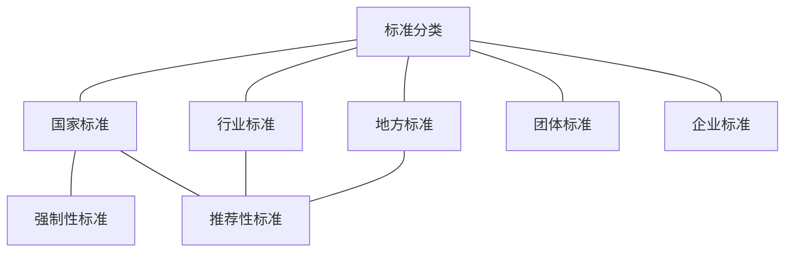

##  解读1

**注：参考《中国质量报》内容梳理。**

全国人民代表大会常务委员会第三十次全体会议审议通过了新修订的《中华人民共和国标准化法》（以下简称《标准化法》）。中国质量监督检验检疫总局党组书记侯建国，中国质量监督检验检疫总局党组成员、中国国家标准化管理委员会主任田世宏，全国人民代表大会法制工作委员会经济法室副主任杨合庆分别就标准化促进我国经济社会的高质量发展、落实以人民为中心的发展思想、标准化制度创新等方面阐述了新修订《标准化法》的重要意义。

### 一、出台背景及意义

中国特色社会主义已进入新的时代，我国经济社会发展已由过去高速度增长转入高质量发展阶段。不久前，《中共中央、国务院关于开展质量提升行动的指导意见》全面部署了质量提升行动。党的十九大提出“必须坚持质量第一、效益优先”。有鉴于此，侯建国强调，《标准化法》的修订对于开展质量提升行动有着积极的促进作用，标准是质量基础设施的重要组成部分，新修订的《标准化法》从立法宗旨到制度设计都体现了质量第一、效益优先的理念，新法中特别强调**县级以上**人民政府要推动全社会运用标准化方式组织生产、经营、管理和服务，发挥标准对促进转型升级、引领创新驱动的支撑作用；明确规定国家支持在重要行业、战略性新兴产业、关键共性技术等领域利用自主创新技术制定团体标准、企业标准；企业研制新产品、改进产品，进行技术改造，都应当符合标准化要求；不符合强制性标准的产品、服务，不得生产、销售、进口或者提供。可以说，《标准化法》的修订实施是全面提升质量的重要举措。

　　众所周知，标准是经济社会活动的技术依据，在国家治理体系和治理能力现代化建设中，发挥着基础性、引领性、战略性作用，修订《标准化法》对我国经济社会发展的意义非比寻常。侯建国在谈到新修订《标准化法》的意义时，紧紧把握党的十九大提出的“我国经济已由高速增长阶段转向高质量发展阶段”这一历史性的判断，首先强调的就是有利于促进我国经济社会高质量发展。他说，高质量的发展离不开先进标准的支撑，新修订的《标准化法》从立法宗旨上就明确要加强标准化工作，提升产品和服务质量，提高经济社会发展水平。新法中对标准的范围、结构、水平都作出了明确规定，构建了政府标准与市场标准协调配套的新型标准体系；明确要求制定标准应当有利于科学合理利用资源，推广科学技术成果，提高经济效益、社会效益、生态效益，做好技术上先进、经济上合理，从而可以更好发挥市场主体活力，更好发挥标准在新技术、新产品推广，以及新产业、新动能发展中的引领支撑作用。

　　十八大以来加速推进的《标准化法》修订工作，凝聚了以人民为中心发展思想的新成果。十九大召开不久发布新修订的《标准化法》，成为标准化工作落实以人民为中心发展思想的新起点。侯建国回顾说，新修订的《标准化法》贯穿了标准化工作从群众中来，到群众中去，一切成果由人民共享的基本要求。发挥社会各方面的作用，充分听取意见，鼓励消费者、企业、社会团体积极参与，政府标准免费公开以及在保障人身健康和生命财产安全，维护生态环境安全、提高经济社会发展水平等领域制定的强制性国家标准优先立项、及时完成、强制实施等规定，无不体现了落实以人民为中心的发展思想。

　　标准是世界“通用语言”，标准化在促进世界互联互通，便利各国经贸往来中作用日益凸显。侯建国在充分肯定近年来中国标准化在助力对外经贸往来、促进产能合作方面取得的成就后指出，新修订《标准化法》对国家积极推动参与国际标准化活动，推动中国标准与国外标准之间的转化运用等相关规定，为标准化工作与国际规则深度融合提供了法律依据，有助于我国更高水平的对外开放。

### 二、主要修订内容

　　相比颁布施行近30年的原《标准化法》，新修订的《标准化法》无论是在标准体系、标准化管理体制还是在标准制修订具体要求等方面都作了适应经济社会发展需要的调整。

　　田世宏认为，新修订的《标准化法》在制度创新等方面有很多亮点，其中比较重要的制度创新包括：

　　一是建立了**政府标准化工作协调机制**，明确要求国务院和设区的市级以上地方人民政府建立标准化协调机制，统筹协调标准化工作重大事项，并要求县级以上人民政府将标准化工作纳入本级国民经济和社会发展规划。

　　二是扩大了标准的制定范围，从原来侧重工业领域，进一步扩展到农业、服务业和社会事业等领域，全方位满足需求，保障标准有效供给。

　　三是强化了强制性标准的统一管理，规定国家标准分为强制性标准和推荐性标准，行业标准、地方标准是推荐性标准；将原来的强制性国家标准、行业标准和地方标准统一整合为强制性国家标准，并对强制性标准的范围做了严格的限定。

　　四是赋予了**团体标准**法律地位，鼓励社会团体组织制定团体标准，构建了政府标准与市场标准协调配套的新型标准体系。

　　五是设立**企业标准自我声明**公开和监督制度，要求企业向社会公开所执行的产品和服务标准相关情况，充分释放了企业创新活力的需要。

　　六是加强了**标准国际化**工作，积极推动参与国际标准化活动，推进中国标准与国外标准之间的转化运用。

　　七是规定了**标准化军民融合**制度，推进标准化军民融合和资源共享，提升军民标准通用化水平，积极推动军民标准相互转化和采用。

## 解读2

**注：参考[深圳市监局](http://amr.sz.gov.cn/xxgk/zcwj/zcjd/content/post_1927962.html)内容梳理。**

十二届全国人大常委会第三十次会议2017年11月4日表决通过了新修订的标准化法。新的标准化法于2018年1月1日开始施行，对于提升产品和服务质量，促进科学技术进步，提高经济社会发展水平意义重大。

### 一、新标准化法修订的背景

　　《中华人民共和国标准化法》由中华人民共和国第七届全国人民代表大会常务委员会第五次会议于1988年12月29日修订通过，自1989年4月1日起施行。全文共五章26条，已实施近30年，对建立和完善我国标准体系、提升产品质量总体水平、促进我国产业结构升级和对外贸易发挥了重要作用，及时有力地推动了我国标准化工作的改革，为我国经济改革与发展，做出了重要贡献。然而，由于《标准化法》是计划经济向市场经济过渡初期的产物，它既表达了发展商品经济的国家意志，也残存了一些计划经济的思想痕迹，具有一定的时代局限性，已经无法满足我国目前社会主义市场经济发展的要求。一是标准范围过窄，主要限于工业产品、工程建设和环保要求，难以满足经济提质增效升级需求；二是强制性标准制定主体分散，范围过宽，内容交叉重复矛盾，不利于建立统一市场体系；三是标准体系不够合理，政府主导制定标准过多，对团体、企业等市场主体自主制定标准限制过严，导致标准有效供给不足；四是标准化工作机制不完善，制约了标准化管理效能提升，不利于加强事中事后监管。因此，国家标准委适时启动了《标准化法》的修订，以解决以上法律运行中的突出问题。

### 二、条文的主要变化

　　新修订的标准化法全文共六章45条，分为总则、标准的制定、标准的实施、监督管理、法律责任、附则。纵观新标准法的全文，主要有以下变化：

　　**（一）关于标准范围**

　　主要变化：标准制定范围从工业领域扩大到农业、工业、服务业以及社会事业等领域。并明确标准样品是实物标准，属于标准体系的组成部分。

　　新标准化法第二条规定：本法所称标准（含标准样品），是指农业、工业、服务业以及社会事业等领域需要统一的技术要求。

　　**（二）关于标准分类**

　　主要变化：现行法从制定主体角度将标准分为国家标准、行业标准、地方标准和企业标准四类；从标准的效力又将标准分为强制性标准和推荐性标准。

　　新标准化法第二条规定：标准包括国家标准、行业标准、地方标准和团体标准、企业标准。国家标准分为强制性标准、推荐性标准，行业标准、地方标准是推荐性标准。

　　**（三）关于标准化协调机制**

　　主要变化：增设了标准化协调机制，对跨部门跨领域存在重大争议标准的制定和实施进行协调。

　　新标准化法第六条规定：国务院建立标准化协调机制，统筹推进标准化重大改革，研究标准化重大政策，对跨部门跨领域、存在重大争议标准的制定和实施进行协调。设区的市级以上地方人民政府可以根据工作需要建立标准化协调机制，统筹协调本行政区域内标准化工作重大事项。

　　**（四）关于标准化奖励**

　　主要变化：增设了对有关单位和个人给与表彰和奖励的规定。

　　新标准法第九条规定：对在标准化工作中做出显著成绩的单位和个人，按照国家有关规定给予表彰和奖励。

　　**（五）关于强制性标准管理**

　　主要变化：新标准化法取消了强制性行业标准和强制性地方标准，仅保留强制性国家标准一级，限定了强制性国家标准的制定范围，并对强制性国家标准的制定进行了职责分工。

　　新标准化法第十条规定：对保障人身健康和生命财产安全、国家安全、生态环境安全以及满足经济社会管理基本需要的技术要求，应当制定强制性国家标准。国务院有关行政主管部门依据职责负责强制性国家标准的项目提出、组织起草、征求意见和技术审查。国务院标准化行政主管部门负责强制性国家标准的立项、编号和对外通报。国务院标准化行政主管部门应当对拟制定的强制性国家标准是否符合前款规定进行立项审查，对符合前款规定的予以立项。省、自治区、直辖市人民政府标准化行政主管部门可以向国务院标准化行政主管部门提出强制性国家标准的立项建议，由国务院标准化行政主管部门会同国务院有关行政主管部门决定。社会团体、企业事业组织以及公民可以向国务院标准化行政主管部门提出强制性国家标准的立项建议，国务院标准化行政主管部门认为需要立项的，会同国务院有关行政主管部门决定。强制性国家标准由国务院批准发布或者授权批准发布。法律、行政法规和国务院决定对强制性标准的制定另有规定的，从其规定。

　　**（六）关于推荐性标准管理**

　　主要变化：新标准化法增加了对推荐性国家标准范围的规定。

　　新标准化法第十一条规定：对满足基础通用、与强制性国家标准配套、对各有关行业起引领作用等需要的技术要求，可以制定推荐性国家标准。推荐性国家标准由国务院标准化行政主管部门制定。

　　**（七）关于地方标准管理**

　　主要变化：新标准化法将地方标准制定权下发到设区的市。

　　新标准化法第十三条规定：地方标准由省、自治区、直辖市人民政府标准化行政主管部门制定；**设区的市**级人民政府标准化行政主管部门根据本行政区域的特殊需要，经所在地省、自治区、直辖市人民政府标准化行政主管部门批准，可以制定本行政区域的地方标准。地方标准由省、自治区、直辖市人民政府标准化行政主管部门报国务院标准化行政主管部门**备案**，由国务院标准化行政主管部门通报国务院有关行政主管部门。

　　**（八）关于团体标准管理**

　　主要变化：新标准化法赋予了团体标准法律地位。

　　新标准化法第十八条规定：国家鼓励学会、协会、商会、联合会、产业技术联盟等**社会团体**协调相关市场主体共同制定满足市场和创新需要的团体标准，由本团体成员约定采用或者按照本团体的规定供社会自愿采用。

　　**（九）关于企业标准管理**

　　主要变化：新标准化法**取消了企业标准备案制度**，建立了企业产品或者服务标准自我声明公开制度，并对公开的方式、内容等做了规定。

　　新标准化法第二十七条规定：国家**实行团体标准、企业标准自我声明公开和监督制度**。企业应当公开其执行的强制性标准、推荐性标准、团体标准或者企业标准的编号和名称；企业执行自行制定的企业标准的，还应当公开产品、服务的功能指标和产品的性能指标。国家鼓励团体标准、企业标准通过标准信息公共服务平台向社会公开。

　　**（十）关于标准公开**

　　主要变化：新标准化法对强制性标准和推荐性标准的公开做出了规定。

　　新标准化法第十七条规定：强制性标准文本应当免费向社会公开。国家推动免费向社会公开推荐性标准文本。

　　**（十一）关于技术委员会**

　　主要变化：现行法规定强制性标准和推荐性标准都应当由技术委员会承担草拟和审查工作。新标准化法对强制性标准和推荐性标准进行了区分处理。

　　新标准化法第十六条规定：制定推荐性标准，应当组织由相关方组成的标准化技术委员会，承担标准的起草、技术审查工作。制定强制性标准，可以委托相关标准化技术委员会承担标准的起草、技术审查工作。未组成标准化技术委员会的，应当成立专家组承担相关标准的起草、技术审查工作。标准化技术委员会和专家组的组成应当具有广泛代表性。

　　**（十二）关于标准实施监督**

　　主要变化：增加了实施监督部门。新标准化法在保留现行法“县级以上政府标准化行政主管部门”的基础上，新增“有关行政主管部门”作为监督检查部门。

　　新标准化法第三十二条规定：县级以上人民政府标准化行政主管部门、有关行政主管部门依据法定职责，对标准的制定进行指导和监督，对标准的实施进行监督检查。

　　**（十三）关于标准实施后评估**

　　主要变化：新标准化法增加了标准实施信息反馈和评估的内容，并规定标准的复审周期。

　　新标准化法第二十九条规定：国务院标准化行政主管部门和国务院有关行政主管部门、设区的市级以上地方人民政府标准化行政主管部门应当建立标准实施信息反馈和评估机制，根据反馈和评估情况对其制定的标准进行复审。标准的复审周期一般不超过五年。经过复审，对不适应经济社会发展需要和技术进步的应当及时修订或者废止。

### 三、新标准化法修订的重要意义

　　**（一）有利于贯彻以人民为中心的发展思想。**

　　新修订的标准化法从立法宗旨到具体制度设计，均贯穿了标准化工作从群众中来，到群众中去，一切成果由人民共享的基本要求。新法扩大了标准制定范围，满足人民日益增长的美好生活需要；规定凡涉及人身健康和生命财产安全、生态环境安全的技术要求，要制定强制性国家标准，并优先立项、及时完成、强制实施；明确政府制定的标准应当免费向社会公开，以利于社会公众了解标准、实用标准。

　　**（二）有利于促进我国经济社会高质量发展。**

　　高质量的发展离不开高标准的支撑。新修订的标准化法第一条就开宗明义，提出加强标准化工作，提升产品和服务质量，提高经济社会发展水平；明确标准制定原则要有利于提高经济效益、社会效益、生态效益，做到技术上先进、经济上合理；进一步强调强制性标准底线要求，同事鼓励制定和实施高于强制性标准和推荐性标准的团体标准、企业标准。

　　**（三）有利于强化标准化工作的法治管理。**

　　新修订的标准化法对标准的制定、实施和监督管理做出了全方位、全过程的规定。建立政府标准化工作协调机制，进一步明确统一管理、分工负责的管理体制；进一步明晰各类标准的制定主体、范围和效力；进一步强化对标准化工作的监督管理，明确监督主体、职责、措施和相应的法律责任。

　　**（四）有利于实现更高水平的对外开放。**

　　标准是世界“通用语言”。新修订的标准化法首次提出国家推动积极参与国际标准化活动，并鼓励各类市场主体参与国际标准化活动；强调标准制定、实施过程的公开性和透明度，使标准化工作与国际规则深度融合，更好地服务国际贸易和产能合作，为中国标准与国际的联通提供法律保障。

