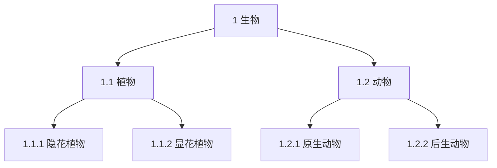

## 6.1 总则

本章主要用于汉语术语标准。其他语种的术语标准或汉语标准的译文版，应符合该语种语言文字自身的表述习惯。

多语种术语标准中的术语、定义、注等各项应采用多栏对照编排，使用栏空、行空或划线等方法使各 语种之间一一对应，各语种的相应条目应在技术上等同，结构上一致。

## 6.2 基本要求

6.2.1 术语标准的编写应符合国家有关法律、法规及相关政策，并符合国家在语言文字方面的规定。

6.2.2 术语标准的编写应符合GB/T 10112—1999、GB/T 16785—1997和GB/T 1.1—2000的有关规定。向国际标准化组织提出中国的术语标准作为国际标准草案或将中国的术语标准译成英语、法语或俄语版本时，还应符合国际标准的有关规定。

6.2.3 术语标准的编写应贯彻协调一致的原则。应与已发布的国家标准、行业标准相协调，与全国科学技术名词审定委员会公布的术语相协调，与相应国际标准的概念体系和概念的定义尽可能一致；相同概念的定义和所用术语应一致。

6.2.4 文字表述、符号使用应符合所用语种的习惯和规范。

6.2.5 汉语术语标准中应列入英语对应词，必要时可列入法语、俄语和其他语种的对应词；少数民族语术语标准应列入汉语和英语的对应词，如果需要，也可列入其他语种的对应词。采用外语对应词的依据和首选顺序是：

a）直接采用ISO或IEC等国际标准中的外语术语；

b）参考采用国际上公认的权威出版物，如ISO、IEC文献，或有影响的协会、学会标准，或国外先进标准、辞书、手册等中的外语术语。

## 6.3 术语的数据类目

6.3.1 数据类目至少应包括：

a）编号；

b）优先术语；

c）对应词；

d）定义。

6.3.2 根据需要也可增加下列各种附加信息：

​	a）注音（例如：汉语拼音、国际音标）；

​	b）缩写形式（如果优先术语是完整形式）；

​	c）完整形式（如果优先术语是缩写形式）；

​	d）符号；

​	e）语法信息；

​	f）专业领域；

​	g）源文献；

​	h）非优先术语及其状态标识（许用的、拒用的和被取代的）；

​	i）概念的其他表述方式（例如：公式、图）；

​	j）参照的相关条目；

​	k）术语惯用法示例；

​	l）注；

​	m）其他语种的对应词。

## 6.4 术语标准的编排

6.4.1 术语标准的编排应符合GB/T 1. 1—2000的有关规定。

6.4.1.1 术语标准的名称除应符合GB/T 1. 1—2000中的规定外，还应符合以下要求：

a）术语标准的名称应表明该标准所属的领域，写作“XXX术语”或“XXX词汇”。

`示例：`

<center>人体测量术语</center>
b）系列标准中的术语标准，其名称应表示为：引导要素，表明该标准所属的领域；主体要素，表明该标准的主题和类型（“XXX术语”或“XXX词汇”），主题要素在引导要素之后空一个字编排或另起一行居中编排。

`示例1：`

<center>纺织品 天然纤维术语</center>
`示例2：`

<center>连续搬运设备<br>架空索道术语</center>
c）由多个部分组成的一项标准，在一个部分的名称中应包含“第X部分：XXX”的补充要素，补充要素在主体要素之后空一个字编排或另起一行居中编排。

`示例1：`

<center>数据处理词汇 第20部分：系统开发</center>
`示例2：`

<center>数据处理词汇<br>第21部分：过程计算机系统和技术过程间的接口</center>
6.4.1.2 术语标准的规范性技术要素是按照系统来划分章条的术语词汇集，并附有索引。

6.4.2 必要时，应在引言中指出涉及术语数据表述方式的一般信息，例如：

a）条目结构和所遵循的字体要求；

b）条目的次序；

c）检索术语的方法，如：

​	1）在以系统方式编排的标准中，如何查找某一指定术语；

​	2）在以汉语拼音字母顺序编排的标准中，如何获得该领域的概念体系；

​	3）在多语种标准中，如何查找某一术语在其他语种中的对应词。

6.4.3 如有必要，可将有关文献列入“参考文献”中。

## 6.5 条目的结构

### 6.5.1 总则

如只用单一语种表述定义，应采用通栏编排；双语种或多语种对照时（包括定义的对照），应采用双栏或多栏对应编排，栏与栏之间用划线或间空隔开，同一条目的不同语种对齐编排。

### 6.5.2 条目编号

位置：置于条目起始顶格排。

字体：黑体。

补充说明：如果不需要表示概念间的关系，条目编号可以是简单的顺序数。如果需要表示概念间的关系，每个条目编号应由两组或多组数字组成，前面各组数字可反映概念的层次和概念间的关系，最后—组为简单的顺序数。这种情况下，条目编号也可作为表示该概念在概念体系中位置的标记。

### 6.5.3 优先术语

位置：置于条目编号后，另起一行空两个字排。

字体：黑体。

建议只选择一个术语作为优先术语。圆括号用于注解或补充说明，方括号表示术语可省略的部分。但在定义、示例和注中只能使用完整的术语。

```
示例1：规格化（用于浮点表示制）
      截断（关于字符串）
      截断（关于计算过程）

示例2：环形网［络］
      浮点表示［制］
      浮点表示［法］
```

如果选择了多个优先术语，每一个都用黑体，独占一行。

```
示例：
02.03.01
      自然数 natural number
      非负整数 nonnegative integer
```

如果某个概念尚无术语或未找到术语，应使用五个小圆点“.....”表示。

优先术语同时是章条标题时，该术语应在其术语的位置上重复并写出定义。

```
示例：
3.2 概念
3.2.1
    概念 concept
    由特征（3.2.4）的独特组合而形成的知识单元。
    注：概念不受语种限制，但受社会或文化背景的影响。
```

### 6.5.4 对应词

位置：对应词按以下规定编排：

​	a）如果仅列出英语对应词，空一个字排在汉语之后。

​	`示例`：标准 standard

​	b）如果列出两种或更多语种的对应词，每种对应词单独占一行，空两个字排。汉语术语标准的对应词排列顺序是英语、法语、俄语，然后是其他语种；少数民族语术语标准对应词的排列顺序是汉语、英语、法语、俄语，然后是其他语种。

字体：对应词之前应加入GB/T 4880所规定的语种代码，代码用白体，空一个字排印对应词。首选对应词用黑体。

```
示例：
标准
en standard
fr norme
ru стандарт
```

补充说明：不同语种间术语的对应，有以下可能：

​	a）一一对应，按上述办法编排；

​	b）如果某一语种有多个对应词，对应词间用分号隔开。首选对应词用黑体，许用对应词用白体（汉语用宋体）。


```
示例1：
07.06.01
  管理程序 supervisory program；executive program；supervisor
```

<hr>

```
示例2：
161
  生物废弃物
  en Biowaste；biological waste
  de Bioabfall；Biogene Abfälle
  ru Биологические отходы；Биоотходы
```

拒用的和被取代的对应词用白体（汉语用宋体）并在圆括号内标明是拒用的还是被取代的（见5.2.6、6.5.8）

​	c）如果某一术语所指称的概念同另一语种对应词所指称的概念的外延不相等，可以采用近义词，在该对应词前加“≈”号，必要时还可加注，以说明概念外延上的差异。

​	d）如果没有适当的对应词或未找到对应词，可以暂缺，暂缺处用五个小圆点“.....”表示。

```
示例：
01.04.06
   程序设计学
   en .....
   fr programmatique
   研究和开发计算机程序方法和计算机程序语言的学科。
```

​	e）在存在多个优先术语的特殊情况下，可以只编排一个对应词，非优先术语可以不编排对应词。

### 6.5.5 缩略形式

位置：置于完整形式之前或之后，根据哪一种形式是优先术语而确定。另起一行空两个字排。

字体：优先术语为黑体；许用术语为宋体。

```
示例：
7.6
    光盘驱动器 optical drive
    光驱
    用激光束在光盘(3.2)上进行数据读出、记录和擦除操作的驱动装置。
```

“光盘驱动器”为完整形式，是优先术语；“光驱”为缩略形式，是许用术语。

英语的缩略形式作为对应词处理。

```
示例：
    雷达 radar
    无线电定向和测距 radio detecting and ranging
```

radar 是 radio detecting and ranging的首字母缩略词。

### 6.5.6 许用术语

位置：置于优先术语之后，按照选用程度排序，每个许用术语均另起一行，空两个字排。

字体：宋体。

```
示列：
4.12
    全辐射体 full radiator; full emitter
    黑体 blackbody
```

### 6.5.7 符号

位置：置于许用术语之后，另起一行空两个字排。

字体：量和单位符号应符合GB 3101、GB 3102的规定。量的符号用斜体；单位符号用正体。

如果符号来自于国际权威组织，应在同一行该符号之后的方括号内标出该组织名称，并在注中给出适用于量的单位名称。

```
示例：
2.4.1
     电阻 resistance
     R[IEC+ISO]
     〈直流电〉在导体中没有电动势时, 用电流除电位差。
     注：电阻用欧姆表示。
```

### 6.5.8 拒用和被取代术语

位置：置于符号之后，另起一行空两个字排，并在其圆括号中标示出是拒用的还是被取代的。

字体：宋体。

补充说明：在标准中，只在必要时才列入这些术语。

```
示例：
    可见辐射 visible radiation
    光 light（被取代）
```

### 6.5.9 专业领域

位置：置于定义之前，同一行。

字体：宋体，尖括号之中。

如果一个术语表示多个概念，应在定义前的尖括号中标明每个概念所属的专业领域。 

```
示例：
2.1.17
    抖动 jitter
    〈电磁兼容〉信号在短时间内的不稳定性，可以是幅度或相位的不稳定，也可以两者兼有。
2.1.18
    抖动 jitter
    〈通信〉数字信号的各个有效瞬时相对于其理想时间位置的短期非累积性偏移。
```

### 6.5.10 定义

位置：置于术语对应词之后，另起一行空两个字排。

字体：宋体。

定义的表述见5.2.5。

如果有拒用和被取代术语，定义应置于拒用和被取代术语之后。

如果定义引自另一项标准，应在定义之后另起一行标出该定义所出自的标准的编号和章条号，用方括号括起，并在参考文献中列出该定义所出自的标准。

```
示例：
4.11
    色调 hue
    色相
    表示红、黄、绿、蓝、紫等颜色特性。
    [GB/T 5698—1985，定义3.6]
```

如果不得不改写另一个标准中的定义，则应在注中说明。

```
示例：
3.1
    概念协调 concept harmonization
    在彼此密切相关的两个或多个概念之间，减少或消除细微差异的活动。
    注1：概念协调是标准化工作不可缺少的组成部分。
    注2：改写GB/T 15237—1994，定义8.3.3。
```

### 6.5.11 概念的其他表述形式

位置：置于定义之后

概念的其他表示形式包括公式、图等。如有插图，正常情况下应放在它所归属条目的同一页上，也可以将所有的插图汇集在一起，放在一个单独的位置。公式的表述应符合GB/T 1. 1—2000中6.6.9的规定；图的绘制及编排应符合GB/T 1.1—2000中6.6.4的规定。

### 6.5.12 相互参见

#### 6.5.12.1 非优先术语参见优先术语

位置：在按系统编排的术语标准中，非优先术语在正文中的位置见6.5.6和6.5.8，其条目编号与优先术语的条目编号相同。

字体：宋体；黑体用于优先术语。

#### 6.5.12.2 参见相关条目

位置：置于定义之后，另起一行空两个字排。

字体：宋体；黑体用于优先术语。

用于指出定义中未出现的需参见的条目，并用“参见：”标记。

如果参见条目多于一个，应用逗号将它们隔开。

```
示例：
2.359
    程序库 program library
    计算机程序（2.81）的有机组织的集合。
    参见：软件库（2.447），系统库（2.494）。
```

#### 6.5.12.3 定义或注中的参见

位置：置于定义或注内。

字体：黑体。

定义或注内出现的在标准中已定义过的优先术语，将参见的条目编号放在括号中，跟在该术语之后。

```
示例：
5.3.1.2
    术语 term
    在特定专业领域（3.1.2）中一般概念（3.2.3）的词语指称（3.4.1）。
```

### 6.5.13 示例

位置：置于“参见”标记之后，另起一行空两个字排。

字体：宋体；示例中的内容根据需要可采用各种字体。

补充说明：为避免与正文混淆，可用方框将示例与正文隔开。

```
示例：
5.4.5.3
    同音异形异义现象 homophony
    发音相同，书写形式和意义均不相同的异义现象。
    汉语示例：
    枇杷（一种常绿乔木或其果实）；
    琵琶（一种弦乐器）。
    英语示例：
    sun（太阳）；
    son（儿子）。
```

### 6.5.4 注

位置：置于定义之后，如有示例应置于示例之后，另起一行空两个字排。

字体：宋体，小五号字。

补充说明：应符合GB/T 1.1—2000中C.3.9的规定。

## 6.6 术语条目的排序

应按系统排序划分章条列出术语（见6.6.1），也允许按混合排序（见6.6.2）和汉语拼音字母顺序排序（见6.6.3）。

### 6.6.1 按系统排序

```
示例：
22.01
    一般概念
22.01.01
    计算器
......
22.02
    类别
22.02.01
    袖珍计算器
22.02.02
    台式计算器
22.02.03
    交流电源计算器
22.02.04
    电池电源计算器
......
22.03
    功能和操作过程
22.03.01
    人工功能
22.03.02
    机器功能
......
22.04
    控制和检验装置
```

### 6.6.2 混合排序

相关条目先按系统排序划分，然后再按汉语拼音字母顺序排序。

### 6.6.3 按汉语拼音字母顺序排序

—般不宜使用按汉语拼音字母顺序排序的方法。如果使用字母排序法，应按汉语拼音的字母顺序。

## 6.7 索引

### 6.7.1 —般原则

术语标准应有汉语拼音索引。

术语的汉语拼音索引应按术语的汉语拼音字母顺序编排。如果术语以阿拉伯数字或外文字母开头或全部为外文字母组成的，则在索引中按拉丁字母、希腊字母、阿拉伯数字的顺序排在汉字之后。

标准中所用语种均应编排索引。

索引中应列出所有优先的和非优先的术语。

编排按汉语拼音字母顺序的索引应符合GB/T 13418—1992或有关专业规则。

### 6.7.2 按系统编排术语标准

按系统编排的术语标准应包含汉语拼音索引和按英语字母顺序编排的英语对应词的索引，两者还可以含轮排索引。

按系统编排的多语种术语标准应包含各语种的字母顺序的索引。

`示例1`：按系统编排的汉语术语标准中的索引

```
1 生物 living being
1.1
    植物 plant
1.1.1
    隐花植物 cryptogamous plant
1.1.2
    显花植物 phanerogamous plant
......
1.2
    动物 animal
1.2.1
    原生动物 protozoan
1.2.2
    后生动物 metazoan
......
```

汉语拼音索引

<table>
    <tr>
        <td><center>D</center></td>
        <td><center>Z</center></td>
    </tr>
    <tr>
        <td><center>动物....................1.2.4</center></td>
        <td><center>真核生物...................1.2</center></td>
    </tr>
    <tr>
        <td rowspan='2'><center>S</center></td>
        <td><center>真菌....................1.2.2</center></td>
    </tr>
    <tr>
        <td><center>植物....................1.2.3</center></td>
    </tr>
    <tr>
        <td><center>生物........................1</center></td>
        <td rowspan='4'><center>  </center></td>
    </tr>
    <tr>
        <td><center>Y</center></td>
    </tr>
    <tr>
        <td><center>原初生物....................1.2.1</center></td>
    </tr>
    <tr>
        <td><center>原核生物......................1.1</center></td>
    </tr>
</table>

英语对应词的索引

<table>
    <tr>
        <td><center>A</center></td>
        <td><center>L</center></td>
    </tr>
    <tr>
        <td><center>animal ...................... 1.2.4</center></td>
        <td><center>living being .................... 1</center></td>
    </tr>
    <tr>
        <td><center>E</center></td>
        <td><center>P</center></td>
    </tr>
    <tr>
        <td><center>eukaryote ...................... 1.2</center></td>
        <td><center>plant ............................ 1</center></td>
    </tr>
    <tr>
        <td rowspan='2'><center>F</center></td>
        <td><center>prokaryote ..................... 1.2</center></td>
    </tr>
    <tr>
        <td><center>protoctist ................... 1.2.1</center></td>
    </tr>
    <tr>
        <td><center>fungus ..................... 1.2.2</center></td>
    </tr>
</table>


### 6.7.3 索引的表达形式

在条目中的术语和在索引中的术语应具有相同的字体形式（例如，黑体或宋体；黑体或白体）；索引应至少包括术语、该术语所对应条目编号。在多语种术语标准中，某语种在索引中的次序应与该语种在条目中的次序相同。

### 6.7.4 复合术语索引的表达形式

英语的复合术语按字母顺序编排的索引应根据需要和可能，包括词组型术语的自然词序和轮排索引。

## 6.8 图示的表示形式

根据需要可以包括系统的图示表示形式。

`示例：`



## 6.9 参考文献

“参考文献”不应包括“规范性引用文件”中已列出的文件，而应包括：

​	a）涉及相关专业领域的术语文献；

​	b）在该标准的制定中最重要的参考文献；

​	c）定义所出自的标准。


<center>_________</center>