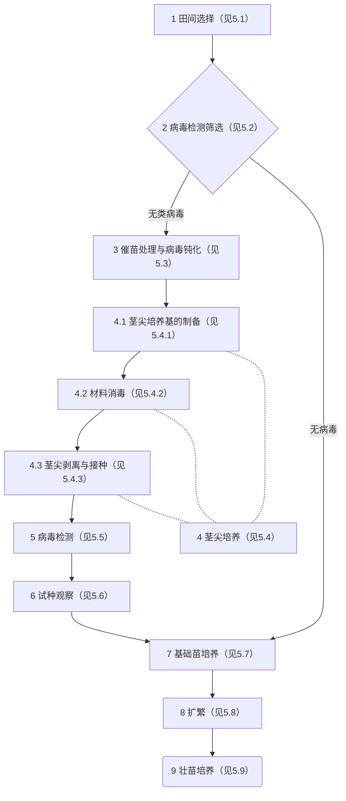

本附录以标准文本形式给出示例的目的，在于帮助标准使用者理解GB/T 20001的本部分的相关规定。示例仅是为了说明本部分的规定而编写或由其他文件改编，选取的要素及其技术内容不保证是最佳和准确的。

以下示例示出了规程标准的程序确立、程序指示、追溯/证实方法等必备要素的编写方法。示例的第4章陈述了马铃薯脱毒试管苗繁育程序的构成，并使用流程图予以展示；第5章规定了履行马铃薯脱毒试管苗繁育程序中各阶段/步骤的行为指示（见5.1.1、5.2.1、5.5.1、5.6.1、5.7.1），以及阶段与阶段之间的转换条件（见5.1.2、5.2.2、5.2.3、5.5.2、5.6.2）；第6章描述了判定程序是否得到履行的追溯方法。

`示例：`

马铃薯脱毒试管苗繁育 技术规程

......

# 4 马铃薯脱毒试管苗繁育程序的构成

马铃薯脱毒试管苗繁育程序包括9个阶段。其中，茎尖培养阶段细分为3个步骤。在第2个阶段检测无病毒的情况下，阶段3、4、5和6可省略。程序流程图如图1所示。

图1 马铃薯脱毒试管苗繁育程序流程图

# 5 马铃薯脱毒试管苗繁育

## 5.1 田间选择

5.1.1 田间选择的操作如下：

a）于现蕾期至开花期，选择具备原品种典型性状的健康植株，贴上标记。

b）生育后期到收获期，在已做好标记的植株中选择出无病斑、虫蛀、机械损伤且性状符合品种特征的幼龄薯。

5.1.2 只准许无病斑、虫蛀、机械损伤且性状符合品种特征的幼龄薯进入病毒检测筛选。

## 5.2 病毒检测筛选

5.2.1 按照GB/T XXXXX—XXXX的XXXX方法检测类病毒（PSTVd）。

5.2.2 只准许经检测不含类病毒（PSTVd）的块茎或植株进入催苗处理与病毒钝化。

5.2.3 只准许经检测不含病毒的块茎或植株进入基础苗培养。

## 5.3 催苗处理与病毒钝化

......

## 5.4 茎尖培养

### 5.4.1 茎尖培养基的制备

......

### 5.4.2 材料消毒

......

### 5.4.3 茎尖剥离与接种

......

## 5.5 病毒检测

5.5.1 病毒检测的操作如下：

a）将试管苗植株下部1/3〜1/2的茎段装入病毒检测的样品袋中。

b）按照GB/T XXXXX—XXXX的XXXX方法检测。

5.5.2 只准许经检测不含PVX、PVY、PVS病毒的试管苗进入试种观察。

## 5.6 试种观察

5.6.1 试种观察的操作如下：

a）将经检测不带病毒的试管苗取出一部分移裁到防虫网棚，等待结薯。

b）将结出的小薯种植到田间。

c）观察田间种植的小薯，检验其是否发生变异。

5.6.2 只准许符合原品种典型性状的核心苗进入基础苗培养。 

## 5.7 基础苗培养

5.7.1 基础苗培养的操作如下：

a）在超净工作台上，对核心苗进行切段。

......

## 5.8 扩繁

......

## 5.9 壮苗培养

......

# 6 追溯方法

## 6.1 标记方法

在马铃薯脱毒试管苗繁育的田间选择阶段，标记的内容包括：

- 做标记时植株的性状；
- 标记的编号；
- 做标记的人员姓名；
- 标记时间；
- 其他。

# 6.2 过程记录

  在执行第5章所规定的各个阶段的程序指示过程中，记录并保持以下内容：

- 执行各个阶段程序指示的人员姓名；
- 时间；
- 地点；
- 执行的具体操作内容；
- 操作的结果或观察到的现象；
- 其他。

......

________

