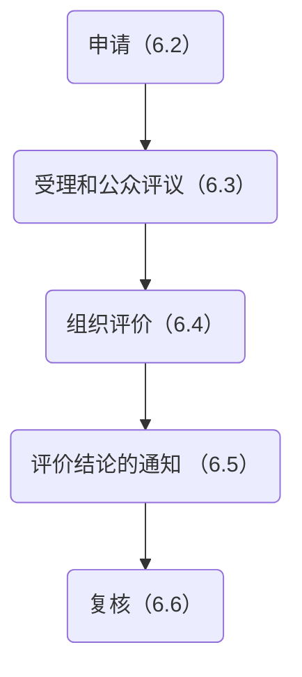

## 6.1 概述

6.1.1 开展团体标准化良好行为评价的程序宜包括申请、受理和公众评议、组织评价、评价结论的通知 和复核，见图1。

图1 团体标准化良好行为评价程序

6.1.2 任何组织或个人认为社会团体有违法违规行为的，可对其进行评议。社会公众进行评议时宜提交书面评议材料和相关证明文件，并对所提交材料的真实性负责。经核实属实的，宜终止团体标准化良好行为评价程序。

## 6.2 申请

6.2.1 申请开展团体标准化良好行为评价的社会团体宜满足以下基本条件：

a）已经在全国团体标准信息平台完成了基本信息公开；

b）制定并发布5项以上（含5项）团体标准，且在全国团体标准信息平台上公布了其标准制定程序及所有标准信息；

c）社会团体宜按照GB/T 20004.1开展标准化工作。

6.2.2 社会团体自愿提出评价申请，并提交以下材料：

a）社会团体的章程；

b）社会团体的标准化组织机构设置及其管理运行制度文件；

c）团体标准的制定程序文件；

d）团体标准的编写规则文件；

e）团体标准的专利政策和版权政策文件；

d）社会团体的投诉机制文件；

g）截至提交申请日期之前的所有团体标准的清单，以及相关标准文本和证明文件。

证明文件包括但不限于：团体标准制定各阶段中的投票记录、会议纪要、公开发文、团体标准涉及专利的处置文件、团体标准版权的处置文件、对投诉的处理文件等的复印件。如果社会团体制定的团体标准多于5项，社会团体选取其中5项，提供标准文本和证明该5项标准制定与6.2.2a）至f）一致的证明 文件。

## 6.3 受理和公众评议

6.3.1 开展评价前，宜通过对外公开的渠道，公告接受评价的社会团体名单。

6.3.2 社会公众可在规定的期限内对公告的社会团体按6.1.2的规定进行评议。

## 6.4 组织评价

6.4.1 宜设立由委员构成的评价委员会，并以召开评价会的形式对社会团体开展团体标准化良好行为评价。参加评价的委员宜：

a）与被评价的社会团体之间没有利益关联或利益冲突；

b）具备相应的专业技术能力和良好的职业道德；

c）始终保持中立的立场。

6.4.2 参加评价的委员在评价时宜：

a）依据6.2.2中收到的材料开展评价，考核该社会团体在制定团体标准过程中的各项文件、行动、记录和报告；

b）逐项评价表A.1中的二级指标对指标说明的满足程度；

c）对6.3.2中的公众评议进行考虑，并给出公众评议是否成立的结论。

6.4.3 参加评价的委员可就某个评价事项提出讨论。

6.4.4 参加评价的委员在综合考虑和评判的基础上给出独立的对该社会团体的团体标准化良好行为评价是否为通过的结论。

6.4.5 当有参加评价的四分之三及以上（弃权票不计数）委员的评价结论为通过时，对该社会团体的团 体标准化良好行为评价结论为通过。

6.4.6 对每次评价宜做好记录和文档保存。

## 6.5 评价结论的通知

6.5.1 宜将评价结论书面通知被评价社会团体。

6.5.2 对于评价结论为通过的社会团体，宜书面告知其团体标准化良好行为评价结论的有效期，并在国家级期刊、媒体或网站上公布该社会团体名单。

6.5.3 对于评价结论为未通过的社会团体，宜书面告知其未通过的理由。

## 6.6 复核

### 6.6.1 复核的发起

6.6.1.1 超过团体标准化良好行为评价结果有效期限的社会团体，可自愿申请复核。

6.6.1.2 社会团体申请复核，宜提交复核申请和以下材料：

a）社会团体的章程；

b）社会团体的标准化组织机构设置及其管理运行制度文件；

c）团体标准的制定程序文件；

d）团体标准的编写规则文件；

e）团体标准的专利政策和版权政策文件；

f）社会团体的投诉机制文件；

g）自上次复核（如果是第一次复核，则是通过评价）后新制定的所有团体标准的清单，以及相关标准文本以及证明文件。

证明文件包括但不限于：团体标准制定各阶段中的投票记录、会议纪要、公开发文、团体标准涉及专利的处置文件、团体标准版权的处置文件、对投诉的处理文件等的复印件。如果社会团体新制定的团体标准多于3项，社会团体选取其中3项，提供标准文本和证明该3项标准制定与6.6.1.2a）至f）一致的证明文件；如果社会团体制定的标准小于或等于3项，社会团体提供所有标准文本和证明标准制定与6.6.1.2a）至f）一致的证明文件。

### 6.6.2 开展复核

复核宜按照6.4的规定开展。

### 6.6.3 形成复核结论

6.6.3.1 复核结论宜书面通知被评价社会团体。

6.6.3.2 如果复核结论确认团体标准化良好行为评价复核通过，则，

a）该社会团体通过团体标准化良好行为评价的结果继续有效； 

b）宜书面告知社会团体复核结果的有效期； 

c）宜通过国家级期刊、媒体或网站发布公告。
6.6.3.3 如果复核结论确认团体标准化良好行为评价复核未通过，宜书面告知社会团体未通过的理由，并给予一次整改机会。

### 6.6.4 整改

6.6.4.1 对于复核结论为未通过的，社会团体可进行整改。

6.6.4.2 社会团体可制定整改计划，按整改计划进行整改，形成整改报告，并将整改报告提请二次复核。

6.6.4.3  如对整改报告的审核结论为合格，则按6.6.3.2中的规定通知社会团体复核结果有效期，并通过国家级期刊、媒体或网站发布公告。

6.6.4.4 如对整改报告的审核结论为不合格，宜撤销该社会团体通过团体标准化良好行为评价的认可，并通过国家级期刊、媒体或网站发布公告。