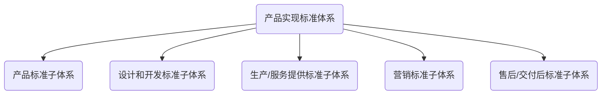
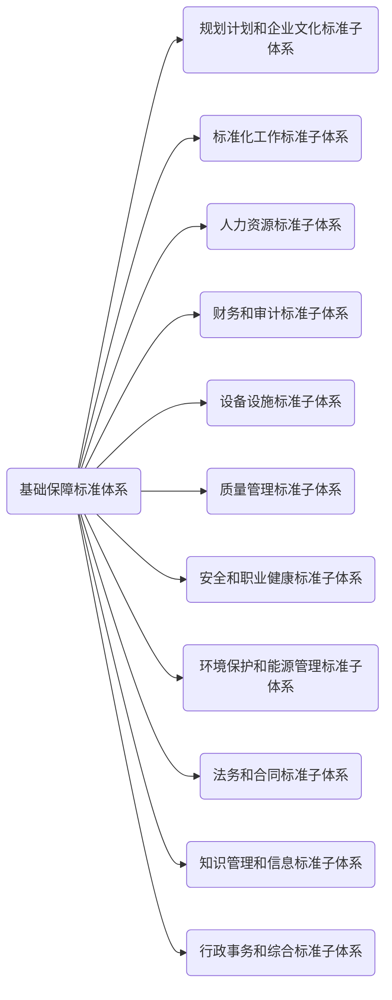
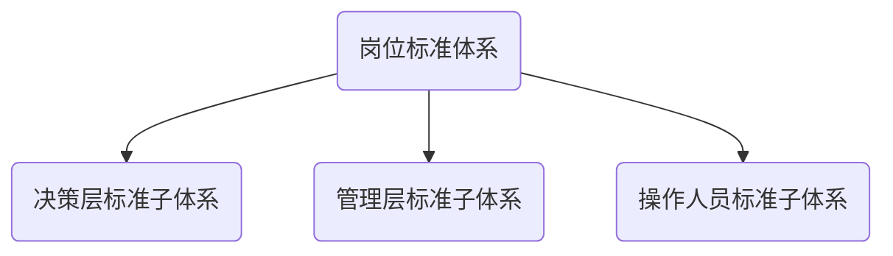

## 5.1 需求分析

5.1.1 企业通过对相关方的需求和期望及企业标准化现状进行分析，形成企业标准体系构建规划、标准化方针、目标，识别企业适用的法律法规和指导标准的要求，构建企业标准体系。企业标准体系构建图见图2。

<b>注：</b>指导标准是企业不直接执行，而需将其全部或部分转化为企业标准体系中的标准，对企业标准体系有指导作用的标准。

图2 企业标准体系构建图

5.1.2 企业可按表1对相关方的需求和期望进行分解。

表1 相关方的需求和期望

<table>
    <tr>
        <th>相关方</th>
        <th>需求和期望</th>
    </tr>
    <tr>
        <td>顾客</td>
        <td>产品的质量、价格、交付及服务</td>
    </tr>
    <tr>
        <td rowspan='2'>企业所有者、股东</td>
        <td>持续的盈利能力</td>
    </tr>
    <tr>
        <td>透明度</td>
    </tr>
    <tr>
        <td rowspan='4'>企业员工</td>
        <td>良好的环境</td>
    </tr>
    <tr>
        <td>职业安全</td>
    </tr>
    <tr>
        <td>职业发展</td>
    </tr>
    <tr>
        <td>得到承认和奖励</td>
    </tr>
    <tr>
        <td>供方和合作伙伴</td>
        <td>互利和连续性</td>
    </tr>
    <tr>
        <td rowspan='2'>社会</td>
        <td>遵守法律法规、环境保护</td>
    </tr>
    <tr>
        <td>道德行为</td>
    </tr>
    <tr>
        <td colspan='2'><b>注：</b>相关方的需求和期望可不限于本表所列内容</td>
    </tr>
</table>

5.1.3 企业可按表2的分析方法，在对相关方的需求和期望分解的基础上，识别相关方需求和期望的关键过程、资源和要素，并确定本企业的标准化对象。

表2 分析方法

<table>
    <tr>
        <th>梳理相关方</th>
        <th>分解需求和期望</th>
        <th colspan='2'>识别关键过程、资源和要素</th>
        <th>确定标准化对象</th>
    </tr>
    <tr>
        <td rowspan='29'>顾客</td>
        <td rowspan='15'>质量</td>
        <td colspan='2'>设计——设计程序和各节点控制标准（决策、设计、试制、 定型、改进）</td>
        <td rowspan='2'>设计和开发标准</td>
    </tr>
    <tr>
        <td>设计——产品设计输入</td>
        <td>需要遵守的相关标准（产品设计、工艺设计）</td>
    </tr>
    <tr>
        <td>设计——产品设计输入</td>
        <td>有明确的产品和服务标准</td>
        <td rowspan='2'>产品标准</td>
    </tr>
    <tr>
        <td>设计——产品设计结果</td>
        <td>产品标准</td>
    </tr>
    <tr>
        <td rowspan='3'>生产——资源</td>
        <td>设备、基础设施</td>
        <td>设备设施标准</td>
    </tr>
    <tr>
        <td>人员</td>
        <td>人力资源标准</td>
    </tr>
    <tr>
        <td>采购程序材料质量</td>
        <td rowspan='7'>生产/服务提供标准</td>
    </tr>
    <tr>
        <td rowspan='5'>生产——过程方法和要求</td>
        <td>现场管理</td>
    </tr>
    <tr>
        <td>工艺（关键、特殊过程）</td>
    </tr>
    <tr>
        <td>监视和测量程序和方法</td>
    </tr>
    <tr>
        <td>标识、包装、运输和防护、贮存</td>
    </tr>
    <tr>
        <td>安装和交付</td>
    </tr>
    <tr>
        <td>生产——结果</td>
        <td>半成品、不合格品/项处置、纠正和预防</td>
    </tr>
    <tr>
        <td rowspan='2'>售后/交付后</td>
        <td>维保、三包服务</td>
        <td rowspan='2'>售后/交付后标准</td>
    </tr>
    <tr>
        <td>产品召回和回收</td>
    </tr>
    <tr>
        <td rowspan='9'>价格</td>
        <td rowspan='4'>设计</td>
        <td>产能、成本</td>
        <td>财务和审计标准</td>
    </tr>
    <tr>
        <td>价值流设计</td>
        <td rowspan='3'>设计和开发标准</td>
    </tr>
    <tr>
        <td>产品通用化、系列化、模块化</td>
    </tr>
    <tr>
        <td>材料选用</td>
    </tr>
    <tr>
        <td rowspan='3'>生产</td>
        <td>库存（仓储物流）</td>
        <td>设备设施标准</td>
    </tr>
    <tr>
        <td>材料领用</td>
        <td rowspan='2'>生产/服务提供标准</td>
    </tr>
    <tr>
        <td>在制品质量和库存</td>
    </tr>
    <tr>
        <td>营销</td>
        <td>营销策划</td>
        <td>营销标准</td>
    </tr>
    <tr>
        <td>财务</td>
        <td>成本控制</td>
        <td>财务和审计标准</td>
    </tr>
    <tr>
        <td rowspan='5'>交付及服务</td>
        <td rowspan='3'>生产</td>
        <td>工时定额</td>
        <td rowspan='3'>生产/服务提供标准</td>
    </tr>
    <tr>
        <td>生产计划管理</td>
    </tr>
    <tr>
        <td>安装交付、运输</td>
    </tr>
    <tr>
        <td>营销</td>
        <td>产品销售</td>
        <td>营销标准</td>
    </tr>
    <tr>
        <td>售后/交付后</td>
        <td>维保、维修、三包、回收、技术支持</td>
        <td>售后/交付后标准</td>
    </tr>
    <tr>
        <td rowspan='10'>企业所有者</td>
        <td rowspan='6'>持续盈利能力</td>
        <td colspan='2'>方针、目标、战略和方法</td>
        <td>规划计划和企业文化标准</td>
    </tr>
    <tr>
        <td colspan='2'>产品和市场</td>
        <td>设计和开发标准</td>
    </tr>
    <tr>
        <td colspan='2'>团队</td>
        <td>人力资源标准</td>
    </tr>
    <tr>
        <td rowspan='2'>资产</td>
        <td>资金和有形资产</td>
        <td>财务和审计标准</td>
    </tr>
    <tr>
        <td>无形资产</td>
        <td>知识管理和信息标准</td>
    </tr>
    <tr>
        <td colspan='2'>营销策划</td>
        <td>营销标准</td>
    </tr>
    <tr>
        <td rowspan='4'>透明度</td>
        <td colspan='2'>财务信息公开</td>
        <td>财务和审计标准</td>
    </tr>
    <tr>
        <td rowspan='2', colspan='2'>非财务信息公开</td>
        <td>规划计划和企业文化标准</td>
    </tr>
    <tr>
        <td>行政事务和综合标准</td>
    </tr>
    <tr>
        <td colspan='2'>产品标准信息</td>
        <td>产品标准</td>
    </tr>
    <tr>
        <td rowspan='6'>企业员工</td>
        <td rowspan='3'>良好的环境</td>
        <td colspan='2'>硬环境</td>
        <td>设备设施标准</td>
    </tr>
    <tr>
        <td rowspan='2', colspan='2'>软环境</td>
        <td>规划计划和企业文化标准</td>
    </tr>
    <tr>
        <td>行政事务和综合标准</td>
    </tr>
    <tr>
        <td>职业安全</td>
        <td colspan='2'>职业健康、安全与应急</td>
        <td>安全和职业健康标准</td>
    </tr>
    <tr>
        <td>职业发展</td>
        <td colspan='2'>培养、任用、考核、晋升、职业生涯</td>
        <td rowspan='2'>人力资源标准</td>
    </tr>
    <tr>
        <td>得到承认和奖励</td>
        <td colspan='2'>奖励、职务晋升</td>
    </tr>
    <tr>
        <td rowspan='3'>供方和合作伙伴</td>
        <td rowspan='3'>互利和连续性</td>
        <td colspan='2'>选择和管理</td>
        <td rowspan='3'>生产/服务提供标准</td>
    </tr>
    <tr>
        <td colspan='2'>供方的培养</td>
    </tr>
    <tr>
        <td colspan='2'>与供方沟通、与顾客沟通</td>
    </tr>
    <tr>
        <td rowspan='6'>社会</td>
        <td rowspan='3'>遵守法律法规a</td>
        <td colspan='2'>法律、法规、规章和强制性标准的收集和分析</td>
        <td>知识管理和信息标淮</td>
    </tr>
    <tr>
        <td colspan='2'>合同法</td>
        <td>法务和合同标推</td>
    </tr>
    <tr>
        <td colspan='2'>劳动法</td>
        <td>人力资源标推</td>
    </tr>
    <tr>
        <td rowspan='3'>环境保护</td>
        <td colspan='2'>环保和节能</td>
        <td>环境保护和能源管理标准</td>
    </tr>
    <tr>
        <td colspan='2'>产品召回和回收再利用</td>
        <td>售后/交付后标准</td>
    </tr>
    <tr>
        <td>道德行为</td>
        <td>企业文化、诚信体系、公益性、社会责任</td>
        <td>规划计划和企业文化标准</td>
    </tr>
    <tr>
        <td colspan='5'><b>注：</b>识别的关键过程、资源和要素以及确定的标准化对象不限于本表所列内容。</td>        
    </tr>
    <tr>
        <td colspan='5'>a 企业应甄別法律、法规、规章和强制性标准所对应的领域，如安全、环境和资源等。把其中的要求转化为标准，纳入相应的标准体系中。如：《劳动合同法》的要求，转化为标准，纳入基础保障标准体系之人力资源标准体系中。</td>        
    </tr>
</table>

5.1.4 企业可按表3对企业标准化现状进行分析，做出标准体系建设的决定。

表3 企业标准化现状分析

<table>
    <tr>
        <th colspan='2'>分析对象</th>
        <th colspan='2'>要素分析</th>
        <th>结论建议</th>
    </tr>
    <tr>
        <td colspan='2'>企业组织机构</td>
        <td colspan='2'>组织机构与业务流程的适宜性</td>
        <td>优化组织机构或建立、调整相关标准体系</td>
    </tr>
    <tr>
        <td rowspan='2'>企业标准体系</td>
        <td>已建立</td>
        <td colspan='2'>体系的目标性、完整性、适宜性</td>
        <td>企业标准体系的延续、变更或再设计</td>
    </tr>
    <tr>
        <td>未建立</td>
        <td colspan='2'>体系的必要性</td>
        <td>按照本标准建立企业标准体系</td>
    </tr>
    <tr>
        <td rowspan='4'>其他管理体系</td>
        <td rowspan='3'>已建立</td>
        <td rowspan='2'>企业标准文件已整合</td>
        <td>通用性要求</td>
        <td rowspan='3'>按照本标准，对各体系内标准文件直接纳入或修订后纳入企业标准体系</td>
    </tr>
    <tr>
        <td>特定性要求</td>
    </tr>
    <tr>
        <td colspan='2'>各管理体系标准未整合</td>
    </tr>
    <tr>
        <td>未建立</td>
        <td colspan='2'>——</td>
        <td>按照本标准建立企业标准体系</td>
    </tr>
    <tr>
        <td colspan='2'>企业管理制度及其他标准</td>
        <td colspan='2'>制度涉及的对象流程等与标准化对象的契合度</td>
        <td>企业标准体系的架构延续、变更或补充，将相关系统性管理活动固化为标推，纳入体系</td>
    </tr>
    <tr>
        <td colspan='5'>分析对象可不限于本表所列内容。</td>
    </tr>
</table>

5.1.5 分析方法和结果应用

分析方法和结果应用示例参见附录B。

## 5.2 结构设计

### 5.2.1 结构

5.2.1.1 根据5.1对相关方的需求和期望、企业标准化现状分析，形成企业标准体系结构图。企业标准体系结构图见图3。

5.2.1.2 企业标准体系由产品实现标准体系、基础保障标准体系和岗位标准体系三个体系组成。企业也可根据自身实际对企业标准体系结构进行自我设计，自我设计的结构应满足企业生产、经营、管理等要求并涵盖本标准、GB/T 15497和GB/T 15498中各子体系要素，附录C给出了企业标准体系其他参考模式。

### 5.2.2 产品实现标准体系

产品实现标准体系应按GB/T 15497的要求构建，一般包括产品标准、设计和开发标准、生产/服务提供标准、营销标准、售后/交付后标准等子体系。产品实现标准体系结构图见图4。

### 5.2.3 基础保障标准体系

基础保障标准体系按GB/T 15498的要求构建，一般包括规划计划和企业文化标准、标准化工作标淮、人力资源标准、财务和审计标准、设备设施标准、质量管理标准、安全和职业健康标准、环境保护和能源管理标准、法务和合同管理标淮、知识管理和信息标准、行政事务和综合标准等子体系。基础保障标准体系结构图见图5。

 图5 基础保障标准体系结构图

### 5.2.4 岗位标准体系

5.2.4.1 岗位标准体系一般包括决策层标准、管理层标准和操作人员标准的三个子体系。岗位标准体系结构图见图6。

 图6 岗位标准体系结构图

5.2.4.2 岗位标准休系应完整、齐全，每个岗位都应有岗位标准。

5.2.4.3 岗位标准宜由岗位业务领导（指导）部门或岗位所在部门编制。

5.2.4.4 岗位标准应以基础保障标准和产品实现标准为依据。当基础保障标准体系和产品实现标准体系中的标准能够满足该岗位作业要求时，基础保障标准体系和产品实现标准体系可直接作为岗位标准使用。

5.2.4.5 岗位标准一般以作业指导书、操作规范、员工手册等形式体现，可以是书面文本、图表、多媒体，也可以是计算机软件化工作指令，其内容可包括但不限于：

a）	职责权限；

b）	工作范围；

c）	作业流程；

d）	作业规范；

e）	周期工作事项；

f）	条件触发的工作事项。

## 5.3 标准明细表

5.3.1 企业应根据企业标准体系结构，对产品实现标准体系、基础保障标准体系和岗位标准体系编制对应的标准明细表。

5.3.2 标准明细表格式应满足企业对标准的管理和运用需要，其表头一般包括：序号、体系代码、标准编号、标准名称、责任部门等内容，也可包括编制该项标准的依据文件信息和关联标准信息等。标准明细表格式可参考示例。

5.3.3 企业标准编号规则应具有唯一性，标准编号宜采用无含义流水号，不与体系代码相关联。

5.3.4 标准明细表中的每一类标准均应有体系代码。体系代码应能反映该标准在体系内的位置及其与其他标准的关系，如BZ0701，BZ为基础保障标准体系的代号，07是基础保障标准体系的第7个子体系为安全和职业健康标准子体系，01是该子体系内的第1类安全标准，每一类内可以是一个标准也可以是多个标准。

<b>示例：</b>基础保障标淮体系之安全和职业健康标准了体系（BZ07）

|  序号  | 体系代码 |    标淮编号     |          标准名称          | 责任部门 |
| :----: | :------: | :-------------: | :------------------------: | :------: |
|   1    |  BZ0701  | GB 13495.1—2015 | 消防安全标志 第1部分：标志 |  办公室  |
|   2    |  BZ0701  |  Q/XXX X—XXXX   |      消防安全管理规范      |  办公室  |
|   3    |  BZ0701  |  Q/XXX X—XXXX   |      应急预案管理办法      |  办公室  |
| ...... |  ......  |     ......      |           ......           |  ......  |
|   10   |  BZ0702  |  Q/XXX X—XXXX   |      职业健康管理办法      |  办公室  |
| ...... |  ......  |     ......      |           ......           |  ......  |

​		

## 5.4 体系编制说明

体系编制说明是企业开展企业标准体系活动的必要说明，内容应包括但不限于：

a）	标准化规划与企业战略相符合的情况；

b）	企业标准体系与标准化规划相符合的情况；

c）	编制体系的依据及要达到的目标；

d）	基础保障标准体系、产品实现标准体系、岗位标准体系内层次的划分依据和划分情况；

e）	自我设计的企业标准体系子体系结构与本标准、GB/T 15497、GB/T 15498企业标准体系了体系结构的对应关系；

f）	与其他体系交叉情况和处理意见；

g）	需要其他体系协调配合的意见；

h）	宜按标准类别，统计标准数最。