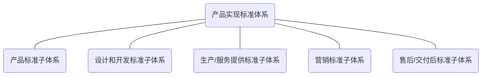

## 3.1 构成

产品实现标准体系一般包括产品标准、设计和开发标准、生产/服务提供标准、营销标准、售后/交付后标准子体系，结构参见图1。

图1 产品实现标准体系结构图

## 3.2 要求

3.2.1 产品实现标准体系是开放、动态的有机系统。企业可根据产品类型和产品实现的过程对产品实现标准体系及其子体系进行设计，包括删减、增补或整合标准体系的内容等。

3.2.2 产品实现标准体系应确保其充分性、适宜性和有效性。

3.2.3 产品实现标准体系应与GB/T 15496和GB/T 15498的规定相互协调。