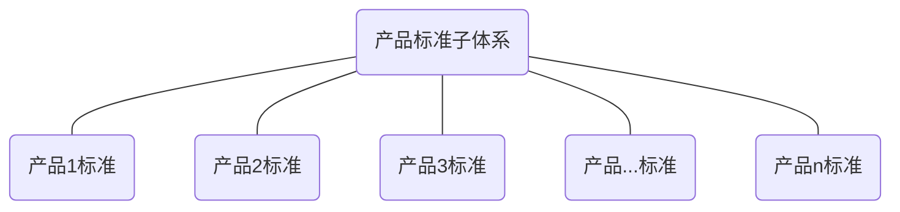

## 4.1 总则

产品标准子体系结构参见图2。

 

图2 产品标准子体系结构图

## 4.2 产品标准

企业根据市场和顾客的需求，结合自身的技术和资源优势，对产品结构、规格、质量特性和检 验/验证方法等做出技术规定，并对产品进行科学地分类，收集、制定的产品标准可包括但不限于：

a）  企业声明执行的国家标准、行业标准、地方标准或团体标准；

**注：**这类标准可直接收集、使用。

b）  企业声明执行的企业产品和服务标准；

c）  为保证和提高产品质量，制定严于国家标准、行业标准、地方标准、团体标准或企业产品和服务标准，作为内部质量控制的企业产品和服务内控标准；

**注：**该标探不作为交付的依据。

d）  与顾客约定执行的技术要求或其他标准。

**注：**其他标准可包括国外技术法规、国际标准、国外先进标准及其他国家的标准等。