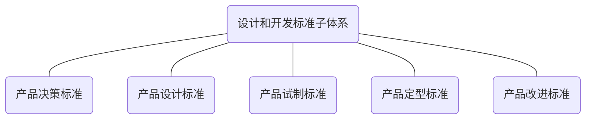

## 5.1 总则

设计和开发标准子体系结构参见图3。

图3 设计和开发标准子体系结构图

## 5.2 产品决策标准

企业对所开发产品的市场或顾客需求、本企业具体情况进行分析、研究，作出开发的决策，收集、制定的产品决策标准，可包括但不限于：

a）  决策信息收集的要求；

b）  决策信息分析内容、方法和程序的要求；

c）  产品决策输出的报告和记录的要求；

d）  决策结果使用的要求。

## 5.3 产品设计标准

企业将产品决策输出的信息作为输入,进行方案拟定、研究试验、设计评审，完成全部技术文件的设计，收集、制定的产品设计标准，可包括但不限于：

a）  产品设计输入的要求，包括产品的质量特性要求、专业设计规范/标准，以及通用化、系列化、模 块化等方面的要求等；

b）  产品设计的方法和程序的要求,包括设计模型、计算方法、设计程序等；

c）  产品设计评审和验证的要求，包括评审和验证的内容、时机和方法等；

d）  产品设计输出的要求，包括技术文件的内容、格式和编号要求、完整性要求、产品型号和命名的要求等。

企业在收集、制定产品设计标准时，应关注环境保护、安全、知识产权保护等。

## 5.4 产品试制标准

企业对通过试验、试制或用户试用，验证产品设计输出的技术文件的正确性、产品符合质量特性要求，收集、制定的产品试制标准，可包括但不限于：

a）  申请产品试制的条件要求；

b）  产品试制责任部门/人员的职责杈限、工作内容及程序和协作关系的要求；

c）  试制产品评审、验证的要求；

d）  试制结论的确认条件及结果应用的要求。

## 5.5 产品定型标准

企业为确保持续稳定达到产品生产/服务提供条件，在产品试制的基础上进一步完善产品生产/服 务提供的方法和手段，改进、完善井定型产品生产/服务提供过程中使用的工具、器具，配置必要的产品 生产/服务提供和试验/测试用的设施、设备，收集、制定的产品定型标准，可包括但不限于：

a）  申请产品定型的条件要求；

b）  产品定型的工作内容和程序、试验内容和方法等；

c）  产品定型文件的要求；

d）  产品生产/服务提供用设施、设备、工具、器具的定型与配置要求；

e）  检验和测量仪器的配置和标定要求；

f）  产品定型确认/批准的要求。

## 5.6 设计改进标准

企业为提高产品质量和适用性，对产品实现各阶段收集到的反馈信息进行分析、处理和必要的试验，收集、制定的设计改进标准，可包括但不限于：

a）改进信息收集、分析等的要求；

b）改进方案编制、评审、验证、确认的要求；

c）改进实施的要求；

d）改进效果评价的要求。