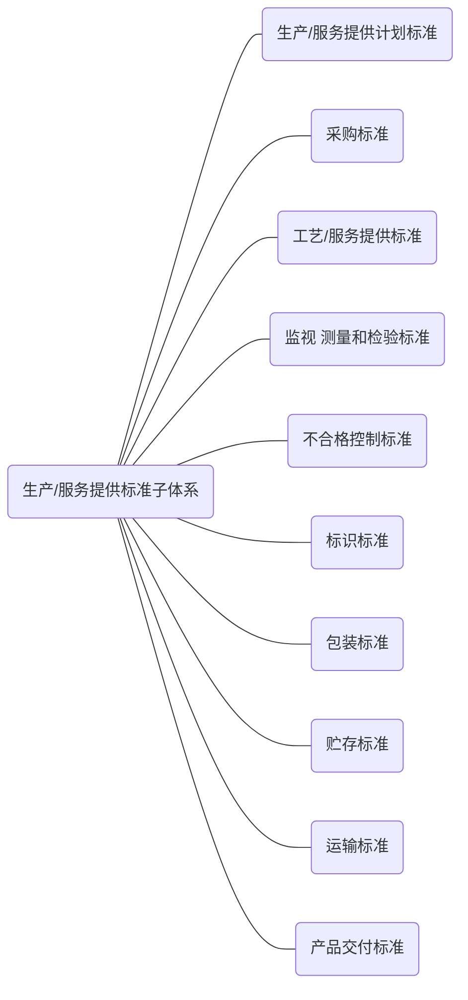

## 6.1 总则

生产/服务提供标准子体系结构参见图4。

 

图4 生产/服务提供标准子体系结构图

## 6.2 生产/服务提供计划标准

企业为确保生产/服务提供的有序组织，根据产品交付/服务需求和本企业的资源提供情况提前做好资源、生产或服务提供的安排，收集、制定的生产/服务提供计划标准，可包括但不限于：

a） 计划的分类；

b） 计划制定的依据、模型/方法、程序以及计划文件等的要求；

c） 计划实施的准备、进度控制、调整的程序以及例外情况处理等的要求；

d） 计划考核的内容、方式、周期以及结果应用等的要求；

e）  计划统计分析的数据、方法、结果应用以及统计报表等的要求。

## 6.3 采购标准

企业对用于产品实现的外部提供的过程、产品以及采购活动的控制，收集、制定的采购标准,可包括但不限于：

a）  品种规格简化、优化的要求，包括规定外部提供过程、产品的限用规则，合理简化品种规格等；

b） 质量要求，包括外部提供产品适用的质量特性、规格、品种、等级等要求，以及外部提供过程、服务的组织、实施及验收要求等；

c）  釆购过程控制要求，包括采购活动的职责、审批权限、釆购流程、订货方法、接收及付款方式、产 品的验证等要求；

d） 供方选择与评定要求，包括对供方的资质和提供产品的能力进行评价和选择，制定选择和评价合格供方的准则等。

## 6.4 工艺/服务提供标准

企业对生产/服务提供的方法、程序和现场管理，收集、制定的工艺/服务提供标准，可包括但不限于：

a）  生产/服务提供方法、程序的要求，包括：

​    1）  生产/服务提供的方法和手段，如使用的设施、设备及用品的配备数量和结构；

​    2）  工作流程和环节划分的方法和要求，以及各环节的操作规范、工作内容和输入输出要求等。

b）  生产/服务提供过程质量控制要求，包括质量控制点设置的原则、工作佐容、控制要求等。

c）  生产/服务提供现场定置管理要求，包括定置管理的目标、内容及程序等。

d）  生产/服务提供操作规范管理要求，包括操作规范的实施、检査及考核等。

## 6.5 监视、测量和检验标准

企业对生产/服务提供的过程及其子过程，以及产品的特性和各过程的结果进行监视、测量和检验， 收集、制定的监视、测量和检验标准，可包括但不限于：

a）  监视、测量和检验方法的要求，包括监视、测量和检验的项目、条件、使用的设备、顺序、试验/评 价方法、周期/频率、组批规则、计算方法、判定规则等要求;

b）  监视、测量和检验程序的要求，包括检验的设置、监视和测量点/过程的选择，监视、测量和检验 的职责和权限、方式、内容以及报告和记录的要求；

c）  监视、测量和检验结果的应用要求，包括结果分析、传递并用于改进。

## 6.6 不合格控制标准

企业对生产/服务提供过程中的不合格进行识别和控制，收集、制定的不合格控制标准，可包括但不限于：

a）  不合格的识别、分类要求；

b）  不合格处理的要求；

c）  纠正和预防措施的要求；

d）  不合格处理记录的要求。

## 6.7 标识标准

企业对生产/服务提供的过程和结果使用的标识，收集、制定的标识标准，可包括但不限于：

a）  标识使用要求，包括标识的内容、位置、数量、紧固方式、操作方法等；

b）  标识管理要求，包括设计、制作、使用和标识零件的贮存等的过程控制；

c）  标识特殊要求，如有追溯要求的产品的标识要求。

## 6.8 包装标准

企业对生产/服务提供使用的包装材料及其规格、质量、工艺要求及过程控制等，收集、制定的包装标准，可包括但不限于：

a）  包装材料要求，包括材料的选择、尺寸、性能和试验要求；

b）  包装工艺要求，包括包装的场所环境、使用工具、方法等；

c）  包装管理要求，包括设计、制作、使用、验收、防护和包装用物品贮存等的过程控制。

## 6.9 贮存标准

企业对生产/服务提供过程中涉及的各类库存物资的贮存环境、摆放、数量和进出等方面的管理，收集、制定的贮存标准，可包括但不限于：

a）物资贮存要求，包括贮存条件、方式、期限等要求，对易腐、易燃、易爆、有毒、有害、放射性产品的特殊贮存要求；

b） 贮存设施的要求,包括贮存设施的类别、结构、布局等；

c）  贮存日常管理要求，包括建立保管账目、定期盘点和维护在库物资等；

d） 贮存出入库管理要求，包括出入库的审批职责和权限、流程、使用的单据等。

## 6.10 运输标准

企业为保证对生产/服务提供过程涉及的各类物资在企业内、外部的运输安全，提高效率，收集、制定的运输标准，可包括但不限于：

a） 运输方式、条件及装卸方式的要求；

b） 运输时限的要求；

c）  运输中防护的要求，以及易腐、易燃、易爆、有毒、有害、放射性产品意外泄漏时的应对措施。

## 6.11 产品交付标准

企业为保证产品交付时满足质量要求，收集、制定的产品交付标准，可包括但不限于:

a） 产品交付条件的要求；

b） 产品交付方法、程序的要求；

c）  产品交付使用的设施、设备的技术要求和精密度要求；

d） 产品交付应检査的项目、程序、检查方法和判定规则等；

e）  产品交付的完整性要求；

f）  产品交付文件的完整性要求。