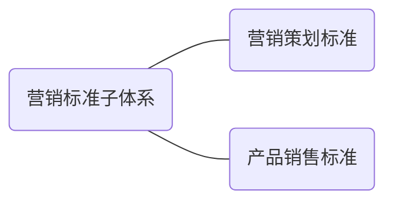

 

##  7.1 总则

营销标准子体系结构参见图5。

图5 营销标准子体系结构图

## 7.2 营销策划标准

企业对产品营销策划过程的控制，收集、制定的营销策划标准，可包括但不限于：

a）营销策划过程管理的要求，包括市场机会分析、顾客需求与期望的了解与分析、目标市场选择、 市场定位、市场营销方案设计和实施、营销活动管理等要求以及相应的工作程序；

b）营销信息管理的要求，包括信息收集的内容和方式、信息的整理分析和研究、信息的传递和存放、信息的使用等要求；

c）顾客关系管理的要求，包括顾客关系的建立、维护及顾客财产的管理等；

d）营销效益评价要求，包括营销效益评价的方法、程序及结果的应用等。

## 7.3 产品销售标准

企业对产品销售的过程进行控制，收集、制定的产品销售标准，可包括但不限于:

a）  销售计划管理的要求；

b）  销售方式管理的要求；

c）  销售渠道管理的要求；

d）  销售区域管理的要求；

e）  销售文件管理的要求。