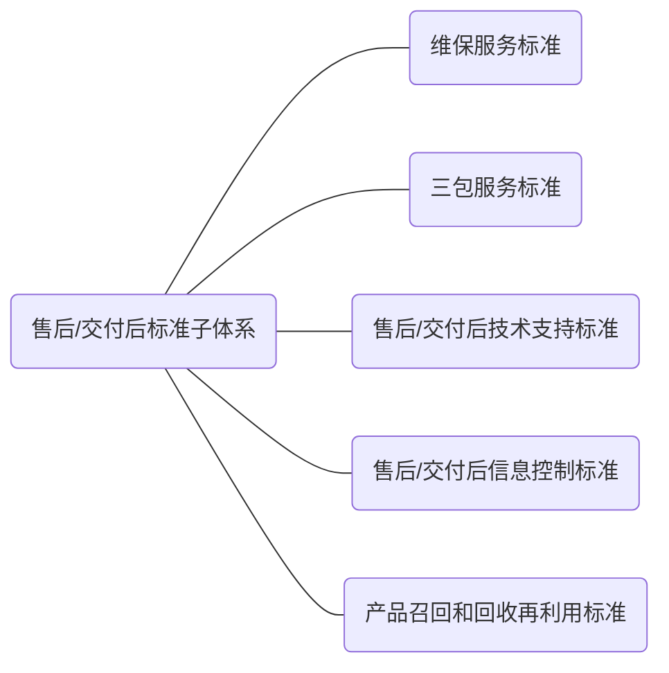

 

## 8.1 总则

售后/交付后标准子体系结构参见图6。

图6 售后/交付后标准子体系结构图

## 8.2 维保服务标准

企业为满足顾客对维修、保养服务的需求，对維修、保养服务的过程进行控制收集、制定的维保服务标准，可包括但不限于：

a）  服务网点的设置评价要求；

b）  服务网点及设施设备要求；

c）  维保服务技术文件的要求；

d）  服务人员要求及服务规范；

e）  服务提供方式的要求；

f）  维保服务工作的内容、程序的要求；

g）  备品备件及维保工具、设备的要求；

h）  顾客档案及维保服务记录的要求。

## 8.3 三包服务标准

企业为履行产品质量责任，收集、制定的三包服务标准，可包括：

a）调换的要求；

b）退货的要求；

c）保修的要求。

## 8.4 售后/交付后技术支持标准

企业对为顾客产品使用和维修、保养和维护等提供技术支持的过程进行控制，收集、制定的售后/交付后技术支持标准，可包括但不限于：

a） 技术支持需求的识别，包括技术支持需求的对象、内容及形式等；

b） 技术支持的提供，包括计划的制定、实施、效果评估、记录及档案等。

## 8.5 售后/交付后信息控制标准

企业对产品售后/交付后顾客反馈的信息进行控制，收集、制定的售后/交付后信息控制标准，可包括但不限于：

a） 售后/交付后信息收集内容、周期、方式的要求；

b） 售后/交付后信息分类的要求；

c）  售后/交付后信息统计、分析的要求；

d） 售后/交付后信息的传递要求；

e）  售后/交付后信息处理的要求；

f）  顾客投诉管理的要求。

## 8.6 产品召回和回收再利用标准

企业对交付到顾客手中的缺陷产品、基本或完全失去使用价值的产品及其他类型的产品进行控制， 收集、制定的产品召回和回收再利用标准，可包括但不限于：

a） 召回、回收再利用产品的技术要求；

b） 召回、回收再利用过程控制的要求；

c）  召回、回收再利用产品处置的要求；

d）  召回、回收再利用效果评价的要求。