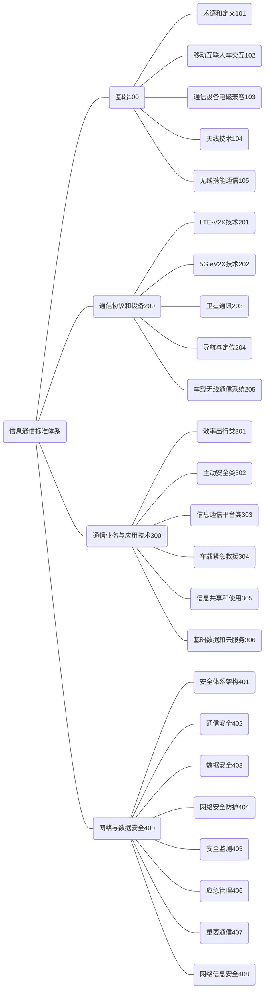

**请注意：**以下内容根据[《<国家车联网产业标准体系建设指南>系列文件》（工信部联科〔2018〕109号）](https://www.miit.gov.cn/zwgk/zcwj/wjfb/zh/art/2020/art_eab131ea349f43c4ba74eaece1377d6f.html)梳理，仅供学习使用。

 

### 前言

为了加强顶层设计，全面推动车联网产业技术研发和标准制定，推动整个产业的健康可持续发展，工业和信息化部、国家标准化管理委员会联合组织制定《国家车联网产业标准体系建设指南》（以下简称《建设指南》）。

车联网产业是汽车、电子、信息通信、道路交通运输等行业深度融合的新型产业，是全球创新热点和未来发展制高点。《建设指南》充分发挥标准在车联网产业生态环境构建中的顶层设计和基础引领作用，按照不同行业属性划分为智能网联汽车标准体系、信息通信标准体系、电子产品与服务标准体系等若干部分，为打造创新驱动、开放协同的车联网产业提供支撑。

《国家车联网产业标准体系建设指南（信息通信）》为《建设指南》第三部分，主要针对信息通信领域通用规范、核心技术与关键产品应用，有目的、有计划、有重点地指导车联网产业信息通信领域标准化工作，加快构建包括通信协议、设备、应用服务及安全在内的信息通信标准体系，充分发挥信息通信标准在车联网产业关键技术、核心产品和功能应用的基础支撑和引领作用，并逐步形成统一、协调的国家车联网产业标准体系架构。

### 一、 车联网产业（信息通信）标准体系总体要求

 

#### （一）指导思想

 

深入贯彻落实习近平新时代中国特色社会主义思想和 党的十九大精神，加速推进制造强国和网络强国建设，发挥 标准的基础性和引导性作用，促进车联网技术和产业发展， 实现工业化和信息化的高度融合，以满足研发、测试、示范、运行等需求，推动汽车网联化技术创新发展和产业转型升级， 带动整车制造、汽车电子等相关产业协调发展，建立跨行业、跨领域、适应我国技术和产业发展需要的车联网信息通信标 准体系。

#### （二）基本原则

 

**立足国情，统筹规划。**结合我国信息通信技术和产业 发展的现状及特点，发挥政府主管部门在顶层设计、组织协调和政策制定等方面的主导作用，制定政府引导和市场驱动相结合的标准体系建设方案，建立适合我国国情的车联网信息通信标准体系。

**基础先立，急用先行。**科学确定车联网信息通信标准体系建设的重点领域，加快基础、共性和关键技术标准的研 究制定；考虑行业发展现状和未来应用需求，合理安排技术 标准的制修订工作进度，加快推进急需标准项目的研究制定。

**夯实基础，有效支撑**。重视在车联网产业中信息通信 的基础作用，做好天线、通信设备电磁环境兼容性等基础性技术研究和标准化，对车联网产业其他部分标准化工作开展形成有效支撑，推进车联网产业信息通信技术提升和拓宽行业应用。

**应用牵引，强化安全。**以车联网产业信息通信服务为着力点，加强车辆紧急救援、安全预警等关系民生的重点应 用的标准化和推广，带动车联网产业的规模化发展。建立健 全网络安全防护体系，制定相关的信息通信安全标准和规范， 提升网络安全防护能力。

#### （三）建设目标

 

车联网产业（信息通信）标准体系以车、路、人、云的 信息交互和相互间安全、有序、高效协同为目标，“十三五” 期间重点研究制定天线技术、通信设备电磁兼容性等基础技术体系，制定基于 LTE-V2X 的无线通信网络建设及关键技术标准体系，探索 5G 技术在车联网产业领域的应用，关注效率出行类、信息娱乐类、通信服务类平台的标准化研究制定工作，制定、完善通信安全相关标准等，支撑车联网产业相关技术发展、促进车联网产业应用和推广。

具体分为两个阶段，2018 年底前完成基础性技术研究， 建立基础性技术标准体系，并形成基于 LTE-V2X 的关键技术标准体系，制定、完善车辆紧急救援、通信安全等重点标准体系建设，针对标准开展试验验证。到 2020 年完成 5G 支持车联网产业系列标准的制定，进一步完善健全信息通信安全与数据安全等标准。

### 二、 车联网产业（信息通信）标准体系建设思路

 

#### （一）建设思路

 

图 1 为信息通信标准体系在国家车联网产业标准体系中的位置以及与其他分标准体系间的关系。

车联网产业（信息通信）标准体系以新一代信息通信技术的应用为切入点，以突破关键技术、培育典型应用为导向， 促进技术创新和产业发展。着力研究 LTE-V2X、5G 等新技术在车联网产业中的应用，制定相关的技术、产品以及应用服务标准，力争通过标准的协调和引领作用，整合相关数据资源，构建大数据和服务平台，促进不同部门和行业间车联网产业数据流通，培育车联网产业典型应用，实现车、路、人、云的有效互联互通。

车联网产业（信息通信）标准体系的构建应当是一个不断完善和调整的动态过程，随着信息技术的不断发展，新的车联网产业服务业态不断涌现，标准体系也将不断更新。在技术上，以开放兼容的视野给各种技术路径选择预留空间。通过标准制定和研发过程，为我国车联网产业（信息通信） 产业发展开辟路径，指明方向，制造机会。

 

#### （二）技术结构图

  

车联网产业（信息通信）标准体系技术结构图如图 2，是从技术角度对车联网产业中涉及信息通信的关键标准进行全面梳理，分为感知层（端）、网络层（管）和应用层（云） 三个层次，并以共性基础技术和信息通信安全技术为支撑。体系架构按照 **“端—管—云”**的方式进行划分，明确各项标准在车联网产业技术体系中的地位和作用，更好地发挥标准体系的顶层设计和指导作用。

共性基础技术主要解决车联网产业涉及的共性问题，并提供有效评估手段，主要包括天线和通信设备电磁兼容性等技术。车联网产业信息通信网络的“端”是具有无线通信能力的车载终端和各种基础设施终端，可以实现车辆与其他车辆以及云平台之间的信息收发以及车辆和交通状态信息的共享，包括车载无线通信终端、路侧通信设施以及个人便携式通信终端等。“管”是利用 V2X、蜂窝网络等通信技术，实现车与车、车与路、车与平台、车与人等的全方位网络连接和信息交互。“云”是综合信息和服务平台，主要包括业务平台、 数据平台和支撑平台，面向各种车联网产业的应用以及应用支撑系统，提供多样化的车联网产业公共服务和行业应用。

### 三、 车联网产业（信息通信）标准体系建设内容

 

#### （一）车联网产业（信息通信）标准体系结构图

 

车联网产业（信息通信）标准体系主要包括基础标准、通信协议和设备、通信业务与应用技术、网络与数据安全标准 4 大部分，如图 3 所示。

图 3 车联网产业（信息通信）标准体系结构图

 

#### （二）标准体系建设内容

车联网产业（信息通信）标准体系主要包含以下内容：

**1. 信息通信类基础标准**

信息通信类基础标准主要包括：术语和定义、移动互联 人车交互标准、通信设备电磁兼容性、天线技术和无线电源等。

目前移动互联人车交互技术主要涉及手机终端与智能 车载无线终端互联的技术方案，包括支持移动互联网应用的车载智能语音交互技术要求及测试方法，智能网联汽车用户体验技术要求及测试方法等。

通信设备电磁兼容性标准主要围绕为保证通信设备能 正常工作时的电磁兼容性要求，包括通信设备的电磁骚扰水平与抗扰能力以及通信设备对人体电磁暴露限值要求和评 估方法等。

车载天线技术标准主要围绕车联网产业涉及的天线性 能开展研究，制定设备天线系列标准，为相关天线性能评估提供技术依据和方法。

无线电源标准主要围绕无线携能通信与车载无线通信 终端的无线充电技术提出技术要求与评估方法并进行标准 化。

**2. 通信协议和设备技术标准**

通信协议和设备技术标准主要涉及 LTE-V2X 技术、5G eV2X 技术、卫星通信、导航与定位技术和车载通信设备技术要求等方面。

LTE-V 技术标准包括：基于 LTE 的车联网无线通信技术接口标准、终端设备标准、网络设备标准、网络层/应用 层标准、互操作标准等。接口标准包括 LTE-V2X 的空口标准等。终端设备标准包括支持 LTE-V2X 通信技术的终端设备和测试规范等。网络设备标准包括支持 LTE-V2X 通信技术的基站设备规范和测试规范等。网络层/应用层标准包括LTE-V2X 通信技术的网络层、应用层标准和相应的测试规范等。互操作标准包括支持 LTE-V2X 通信技术的终端间互操作标准、终端与网络设备互操作标准等。

5G eV2X 技术标准包括：5G eV2X 的空口标准，支持5G eV2X 通信技术的终端设备规范和测试规范，支持 5G eV2X 通信技术的基站设备规范和测试规范，支持 5G eV2X 通信技术的终端间互操作标准、终端与网络设备互操作标准和 5G 与 LTE-V2X 融合异构网联总体技术要求等，5G 基站、终端设备技术要求和测试方法。

卫星通信技术标准包含卫星通信地球站设备车载（静止/移动）天线和伺服系统测试方法、车载卫星通信设备电磁 兼容性要求和测试方法、车载卫星终端通用技术要求和测试方法等。

导航定位标准包括车载导航定位性能、定时技术和电磁兼容性的技术要求和测试方法。车载导航定位标准将为车载导航定位性能评估提供测试依据，包括射频性能、空间性能、一致性等，定位方式包括北斗、GPS 等多模独立定位、通信网络辅助定位等。车载定时标准将为车载定时性能评估提供测试依据，包括定时准确性、稳定性等。

车载无线通信系统标准主要包含车载无线设备技术要 求和检测方法，车载窄带语音通信设备传输性能要求和测试方法，车载无线通信接口技术要求和测试方法，车载通信终端与手持终端互联规范等。

**3.   通信业务与应用技术标准**

车联网产业相关的业务与应用包括效率出行类应用、主动安全类应用、信息通信平台类应用、车载紧急救援应用、信息共享和使用、基础数据和云服务等。通信业务与应用技术标准主要规定具体服务产品和系统在联网以及互联互通时对公共通信网的功能要求、性能要求以及对应的试验方法等。例如，针对效率出行类制定智能运输系统中道路信息结构化和交互数据集标准；针对主动安全类应用开展基于网联式的主动安全通信性能和自动驾驶技术通信性能要求和测试方法；针对信息通信平台制定车载服务平台接口技术要求及测试方法、平台与车载终端信息交互（OTA 技术等）技术要求及测试方法等标准；车载紧急救援通信系列标准主要面向车辆遇到突发状况采取紧急救援是对通信网要求开展的标准化，包括紧急救援应用通信功能模型、网络架构、通信业务流程、接口、紧急信息采集、消息格式等内容，涉及网络业务平台、承载网络及通信设备的功能和性能要求；信息共享和使用包括车联网产业数据共享与开放相关要求等； 制定基础数据和云服务平台的参考架构、公共服务数据开放共享与流通等。

**4. 网络与数据安全**

车联网产业网络与数据安全包括通信网络安全体系架 构、通信安全、数据安全、网络安全防护、安全监控、应急 管理、重要通信、网络信息安全等。通信网络安全体系架构标准包括总体安全架构要求；通信安全标准包括车内通信、V2X 通信安全要求、智能通信网关安全要求和测试方法等； 数据安全标准包括数据安全及用户个人通信信息保护；网络安全防护标准包括信息通信服务平台安全防护与测评相关要求；安全监测标准包括车辆通信安全监测技术要求；应急管理标准包括车辆联网通信的应急管理要求；重要通信包含车联网 HI 接口的技术要求和实施要求以及车联网实名登记数据要求等；网络信息安全包含信息服务平台通信信息安全保障技术要求等。

#### （三）标准体系表

 （略）

 

### 四、 组织实施

继续落实好《车联网创新发展工作方案》等文件部署， 加强与《国家车联网产业标准体系建设指南》其他部分的衔接。加强沟通协作，由通信行业与电子信息、汽车等行业的标准化组织合作协同推进。注重车联网产业链上下游的协同， 总体统筹，有序推进。标准体系实施动态更新完善机制，根 据产业发展情况和未来需求，不断完善车联网产业（信息通 信）标准体系。

加强国际交流，组织中外企业和标准化组织开展交流合作，积极参与国际标准化组织（ISO）、国际电联（ITU）、第三代合作伙伴计划（3GPP）、欧洲电信标准化协会（ETSI）、国际电工技术委员会（IEC）等相关国际标准化组织的标准制定工作。充分发挥IMT-2020（5G）推进组的作用，推进相关标准的制定和落地，为产业发展提供技术规范和良好政策环境。