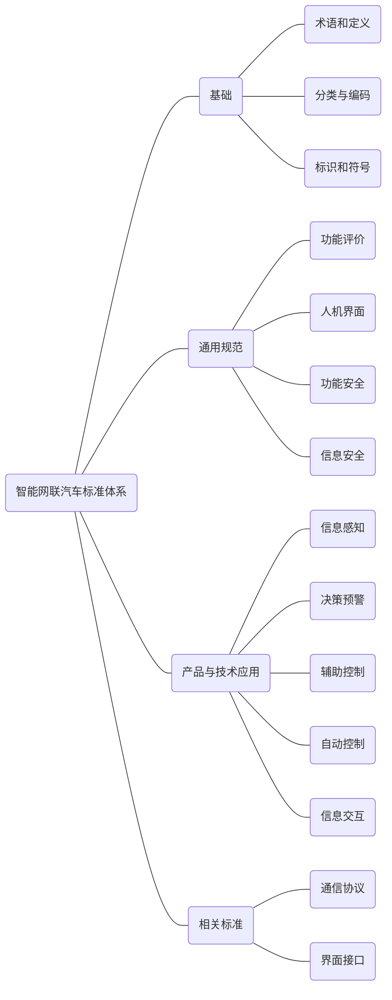
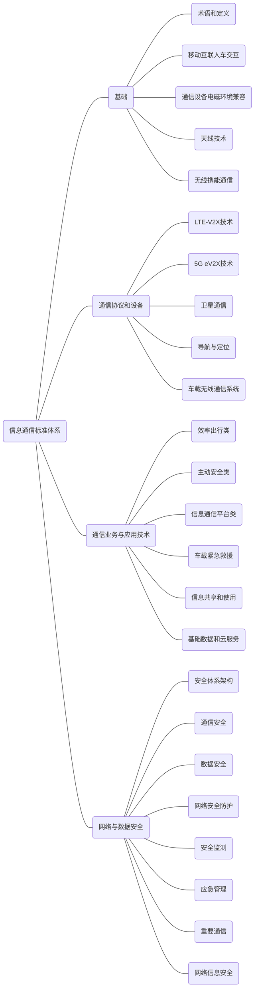
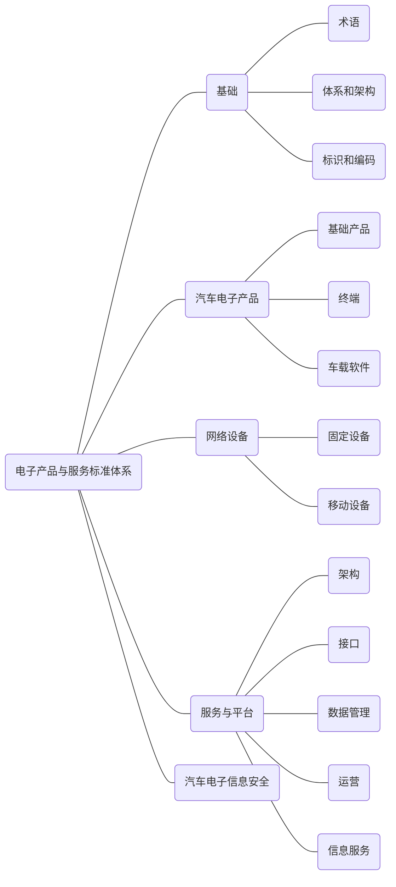
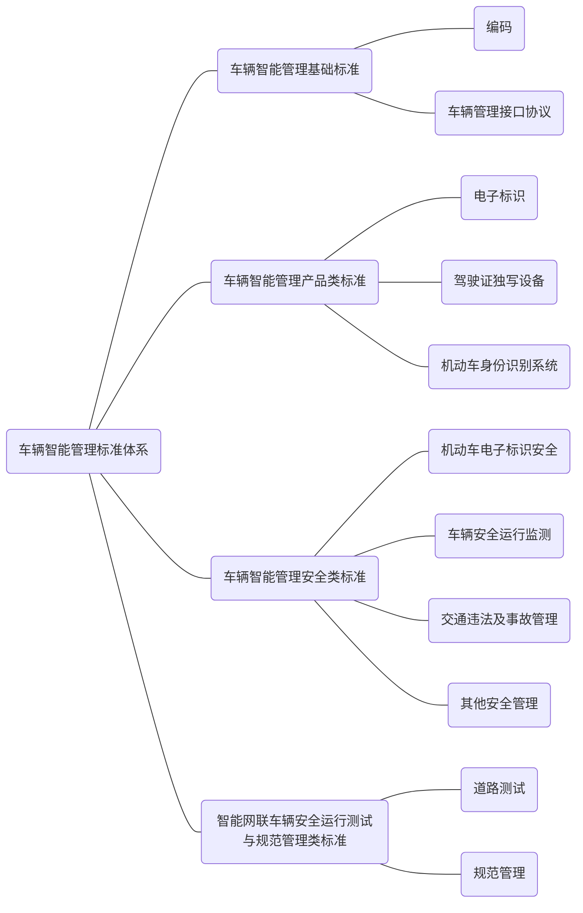

**请注意：**以下内容根据[《<国家车联网产业标准体系建设指南>系列文件》（工信部联科〔2018〕109号）](https://www.miit.gov.cn/zwgk/zcwj/wjfb/zh/art/2020/art_eab131ea349f43c4ba74eaece1377d6f.html)梳理，仅供学习使用。

 

 

### 前 言

为了加强顶层设计，全面推动车联网产业技术研发和标准制定，推动整个产业的健康可持续发展，工业和信息化部、国家标准化管理委员会联合组织制定《国家车联网产业标准体系建设指南》（以下简称《建设指南》）。

车联网产业是汽车、电子、信息通信、道路交通运输等行业深度融合的新型产业，是全球创新热点和未来发展制高点。《建设指南》充分发挥标准在车联网产业生态环境构建中的顶层设计和基础引领作用，按照不同行业属性划分为智能网联汽车标准体系、信息通信标准体系、电子产品与服务标准体系等若干部分，为打造创新驱动、开放协同的车联网产业提供支撑。

《国家车联网产业标准体系建设指南（总体要求）》为《建设指南》第一部分，主要是提出车联网产业的整体标准体系结构、建设内容，指导车联网产业标准化总体工作，推动逐步形成统一、协调的国家车联网产业标准体系架构。


### 一、基本要求

#### （一）指导思想

 深入贯彻落实习近平新时代中国特色社会主义思想和党的十九大精神，加速推进制造强国和网络强国建设，发挥标准的基础性和引导性作用，促进车联网技术和产业发展， 实现工业化和信息化的高度融合，以满足研发、测试、示范、运行等需求，推动车联网技术创新发展和汽车、电子、信息、通信等相关产业转型升级，建立跨行业、跨领域、适应我国技术和产业发展需要的国家车联网产业标准体系。

#### （二）基本原则

 **立足国情，统筹规划。**结合我国车联网技术和产业发展 的现状及特点，发挥政府主管部门在顶层设计、组织协调和政策制定等方面的主导作用，制定政府引导和市场驱动相结合的标准体系建设方案，建立适合我国国情的国家车联网产业标准体系。

**基础先立，急用先行。**科学确定国家车联网产业标准体 系建设的重点领域，以智能控制和信息通信为着力点，充分考虑标准的适用性，加快共性基础、关键技术、产业急需标准的研究制定。实现标准与车联网产业发展的结合、行业标准与国家标准的结合、国内标准与国际标准的结合。

**企业主体，协同推进。**发挥企业在技术创新、产业化和市场推广等方面的主体作用；充分利用现有基础和成果，整合汽车、交通、电子、通信、公安等行业现有资源，通力合作，共同构建国家车联网产业标准体系。

**鼓励创新、注重实施。**加快满足中国发展需求、支持创 新发展的车联网产业标准制定，充分发挥标准在技术创新路径选择、创新成果转化、产业整体技术水平提升等方面的规范和引领作用，实现车联网产业健康有序发展。

**兼容开放、动态更新。**构建统筹协调的工作机制，根据技术进步和产业发展，以开放兼容的视野适时调整、完善车联网产业标准体系，形成标准对技术与产业进步有效支撑。

#### （三）建设目标

 针对车联网产业“十三五”发展需要，加快共性基础标准制定，加紧研制自动驾驶及辅助驾驶（ADAS，Advanced Driver Assistant Systems）相关标准、车载电子产品关键技术标准、无线通信关键技术标准、面向车联网产业应用的5G eV2X 关键技术标准制定，满足产业发展需求。到 2020 年，基本建成国家车联网产业标准体系。

 

### 二、车联网产业标准体系结构

####  （一）车联网产业概念

 车联网产业是依托信息通信技术，通过车内、车与车、车与路、车与人、车与服务平台的全方位连接和数据交互， 提供综合信息服务，形成汽车、电子、信息通信、道路交通运输等行业深度融合的新型产业形态。发展车联网产业，有利于推动智能交通，实现自动驾驶，促进信息消费，有利于推动汽车节能减排，对我国实施创新驱动发展、推进供给侧结构性改革、建设制造强国和网络强国具有重大意义。

#### （二）车联网产业标准体系建设结构图

 

 

 上图所示车联网产业标准体系建设图清晰地表明了国 家积极引导和直接推动跨领域、跨行业、跨部门合作的战略意图。在国家法律政策和战略要求的大框架下，充分利用和整合各领域、各部门在车联网产业标准研究领域的基础和成果，调动各个行业通力合作，共同制定具有中国特色的车联网产业标准体系。《国家车联网产业标准体系建设指南》充分发挥标准在车联网产业生态环境构建中的顶层设计和基础引领作用，按照不同行业属性划分为智能网联汽车标准体系、信息通信标准体系、电子产品与服务标准体系等分册， 为打造创新驱动、开放协同的车联网产业提供支撑。

### 三、建设内容

 标准体系按照汽车、通信、电子、交通和公安五大行业领域进行划分。

#### （一）智能网联汽车标准体系

 **1.**  **标准体系结构图**





**2.** **标准分类说明**

**（1） 基础**

基础类标准主要包括智能网联汽车术语和定义、分类和编码、标识和符号等三类基础标准。术语和定义标准用于统一智能网联汽车相关的基本概念。分类和编码标准用于帮助各方统一认识和理解智能网联标准化的对象、边界以及各部分的层级关系和内在联系。标识和符号标准用于对各类产品、技术和功能对象进行标识与解析。

**（2） 通用规范**

通用规范类标准从整车层面提出全局性的要求和规范， 主要包括功能评价、人机界面、功能安全和信息安全等方面。

功能评价标准主要从整车及系统层面提出智能化、网联化功能评价规范以及相应的测试评价应用场景。人机界面着重考虑智能网联汽车的驾驶模式切换和与其他交通参与者信息传达交互等问题。功能安全标准侧重于规范智能网联汽车各主要功能节点及其下属系统在安全性保障能力方面的要求。信息安全标准主要针对车辆及车载系统通信、数据、软硬件安全，从整车、系统、关键节点以及车辆与外界接口等方面提出风险评估、安全防护与测试评价要求。

**（3） 产品与技术应用**

产品与技术应用类标准主要涵盖信息感知、决策预警、辅助控制、自动控制和信息交互等智能网联汽车核心技术和应用的功能、性能要求及试验方法。

**（4） 相关标准**

相关标准主要包括车辆信息通信的基础——通信协议， 主要涵盖实现车与 X（人、车、路、云端等）智能信息交互的中、短程通信、广域通信等方面的协议规范；在各种物理层和不同的应用层之间，还包含软、硬件界面接口的标准规 范。

#### （二）信息通信标准体系




**2.** **标准分类说明**

信息通信标准体系主要包含以下内容：

**（1） 基础标准**

基础标准主要包括：术语和定义、移动互联人车交互标准、通信设备电磁环境兼容、天线技术和无线携能通信等。

目前移动互联人车交互技术主要涉及手机终端与智能车载终端互联的技术要求及测试方法等。通信设备电磁环境兼容标准主要围绕电磁环境与车、人之间的兼容特性评估。车载天线技术标准主要围绕车联网产业涉及的天线性能开展研究和标准制定。无线携能通信标准主要围绕整车无线供电与车载无线充电技术提出技术要求与评估方法并进行标准化等。

**（2） 通信协议和设备标准**

通信协议和设备技术标准主要包括 LTE-V2X 技术、5G eV2X 技术、卫星通信、导航与定位和车载无线通信系统等方面。

LTE-V2X 技术和 5G eV2X 技术标准主要包括：V2X 接口标准、网络通信标准、基站设备规范和测试规范、网络层/应用层标准、终端间互操作标准、终端与网络设备互操作 标准等。卫星通信标准包含天线和伺服系统、车载卫星通信系统等。导航与定位标准包括车载导航定位性能、定时技术和电磁兼容性的技术要求和测试方法。导航与定位相关详细内容可参考国家测绘地理信息局 2017 年 9 月新修订发布的《测绘标准体系》。车载无线通信系统标准主要包含车载语音、数据业务接入设备、车载无线通信接口技术要求和检测 方法等。

**（3） 通信业务与应用技术标准**

通信业务与应用技术包括效率出行类、主动安全类、信息通信平台类、车载紧急救援、信息共享和使用、基础数据和云服务等方面。通信业务与应用技术标准主要规定具体服务产品和系统的功能要求、性能要求以及对应的试验方法 等。

**（4） 网络与数据安全**

网络与数据安全标准包括安全体系架构、通信安全、数据安全、网络安全防护、安全监控、应急管理、重要通信和网络信息安全等方面。

#### （三）电子产品与服务标准体系

 

**1. 标准体系结构图**




**2.** **标准分类说明**

电子产品与服务标准体系主要包括基础、汽车电子产 品、网络设备、服务与平台、汽车电子信息安全等标准。

（1） 基础标准

基础类标准主要包括术语、体系和架构、标识和编码等标准。术语标准为其他各部分标准的制定提供支撑。汽车电子新型体系架构主要规范信息服务的体系框架，明确其边界及各部分的层级关系和内在联系；标识和编码可以支持对车载终端设备的辨识、寻址、路由和访问。

（2） 汽车电子产品标准

汽车电子产品是指智能网联汽车、车联网和车载信息服务中，具备感知、计算、反馈、控制、执行、通信、应用等 功能，实现信息感知、高速计算、状态监测、行为决策和整车控制的基础电子产品。主要包括基础产品、终端和车载软件等标准。

（3） 网络设备

网络设备类标准主要包括固定设备和移动设备两个领 域的标准。固定设备主要指路边单元等固定设备。移动设备 类主要指手持诊断设备、工程维修、车辆故障在线分析仪器 等专门领域的设备。

（4） 服务与平台标准

车载服务平台包括平台的架构、接口、数据管理、运营以及信息服务五个方面的标准。平台架构主要确定平台基本架构规范；平台接口规定了平台与终端、平台间、平台与上层管理系统等方面的接口标准；平台数据管理包括数据接 口、数据管理和大数据应用方面的要求和规范；平台运营主 要规定了平台运营功能要求；信息服务包括云服务、地理信息和位置导航服务、运维服务、辅助/自动驾驶服务、紧急 救援服务、道路交通信息服务、车载广播服务等标准。

（5） 汽车电子信息安全

汽车电子信息安全类标准指汽车电子产品的入侵检测 防护、访问控制、安全通信、安全态势感知等相关技术标准， 包括车载系统安全、车载终端安全、车载信息与服务安全、应用软件和服务运营平台安全、车载操作系统在线升级安全等标准。


#### （四）智能交通相关标准体系

**1.** **标准体系结构图**

 ```mermaid
graph LR
	节点00(智能交通标准体系)
	节点01(智能交通基础标准)
	节点0101(术语与定义)
	节点0102(分类编码与符号)
	节点0103(智能交通数据管理)
	节点02(智能交通服务标准)
	节点0201(交通管理)
	节点0202(出行服务)
	节点0203(运输组织)
	节点03(智能交通技术标准)
	节点0301(交通信息采集)
	节点0302(ITS专用通信)
	节点0303(ITS信息安全与应用)
	节点04(智能交通产品标准)
	节点0401(ITS路侧及中心系统)
	节点0402(ITS便携设备)
	节点05(智能交通相关标准)
	节点00---节点01
	节点00---节点02
	节点00---节点03
	节点00---节点04
	节点00---节点05
	节点01---节点0101
	节点01---节点0102
	节点01---节点0103
	节点02---节点0201
	节点02---节点0202
	节点02---节点0203
	节点03---节点0301
	节点03---节点0302
	节点03---节点0303
	节点04---节点0401
	节点04---节点0402
	
 ```


**2.** **标准分类说明**

智能交通相关标准体系以规范智能交通系统（ITS）技术、服务和产品为重点任务。智能驾驶、车路协同等重点技 术是当前 ITS 领域的研究热点和发展趋势，是新一轮科学技术及产业发展的重要竞争领域，对提升交通安全、缓解交通 拥堵、促进节能减排、拉动上下游产业有重要意义。

（1） 智能交通基础标准

智能交通基础类标准主要包括术语与定义、分类编码与符号和智能交通数据管理等。术语与定义主要包括智能运输系统相关术语、定义；分类编码与符号主要包括编码规则、代码结构和图形符号类标准；智能交通数据管理主要包括数据表达与管理、数据元、数据字典类标准等。

（2） 智能交通服务标准

智能交通服务类标准主要包括交通管理、出行服务、运输组织等。交通管理类标准主要包括交通管理与控制、事件 管理与应急等标准；出行服务主要面向出行者提供的各类服务，包括电子支付服务、一体化出行服务、智能驾驶服务等标准；运输组织主要面向运输企业提供的各类服务，包括客运服务智能化、物流信息化、营运车辆运行服务等标准。

（3） 智能交通技术标准

智能交通技术类标准主要包括交通信息采集、ITS 专用通信和ITS 信息安全与应用。交通信息采集是指交通设施、运输工具、交通运行、道路环境等信息采集、道路状态感知 技术指标和参数。ITS 专用通信是指不同设备、系统、服务和交通参与者间的数据传输、信息交换等标准。ITS 信息安全与应用是指数据安全、交易安全、身份认定、网络信任等相关标准。

（4） 智能交通产品标准

智能交通产品类标准主要包括 ITS 路侧及中心系统和ITS 便携设备等。ITS 路侧及中心系统是指路侧类设备的工艺、性能、安装等要求和测试方法，以及中心或后台系统的 性能、部署等要求和测试方法；ITS 便携设备是指车载、手持等移动终端、便携设备的工艺、性能、安装等要求以及测试方法。

（5） 智能交通相关标准

智能交通相关标准主要包括与智能交通关系比较密切 的其它交通运输类标准。

#### （五）车辆智能管理标准体系

**1.** **标准体系结构图**





**2.** **标准分类说明**

车辆智能管理标准体系主要研究并制定相关法律法规， 对交通安全行为进行有效规范，降低法律风险，促进车联网产业有序发展。主要包括车辆智能管理相关的基础标准、产品类标准、安全类标准和安全运行测试与规范管理类标准等。


（1） 车辆智能管理基础标准

车辆智能管理基础标准主要包括机动车/驾驶人电子身 份代码编码规范、机动车电子标识读写基础协议等。

（2） 车辆智能管理产品类标准

车辆智能管理产品类标准主要包括汽车、机动车电子标识安装规范、机动车电子标识读写设备通用技术条件和安装规范、驾驶证读写设备通用技术条件、机动车身份识别系统中间件技术要求、机动车身份识别系统架构、机动车身份识别系统信息交换和共享技术要求以及管理服务平台技术要 求、机动车车载终端交通执法数据访问接口规范等。

（3） 车辆智能管理安全类标准

车辆智能管理安全类标准主要包括机动车电子标识安 全技术要求、机动车电子标识读写设备安全技术要求、机动车电子身份模块安全技术要求、机动车电子标识密钥管理系 统技术要求、机动车车辆身份识别系统安全技术要求、智能网联车辆交通违法行为取证规范、智能网联车辆交通事故责任认定方法和程序要求、道路交通安全违法行为、卫星定位 技术取证规范、驾驶证读写设备安全技术要求、车载终端与交通信号控制机交互技术规范、车载终端与交通安全设施接口规范等。

（4） 智能网联车辆安全运行测试与规范管理类标准 智能网联车辆安全运行测试与规范管理类标准主要包括智能网联车辆公共道路测试管理规范、智能网联车辆公共道路测试申请程序指南、智能网联车辆测试基地建设和验收要求、智能网辆安全运行测试技术要求、智能网联车辆安全运行测试项目和方法、智能网联车辆测试与使用车牌、智能网联车辆注册程序要求、智能网联车辆驾驶教育和培训技术指南、智能网联车辆外观标识等。

# 四、组织实施

 

由工业和信息化部会同交通运输部、公安部等部门，组织标准化机构、科研院所、产业联盟、企业等单位，按照本标准指南共同开展车联网产业标准制定工作。