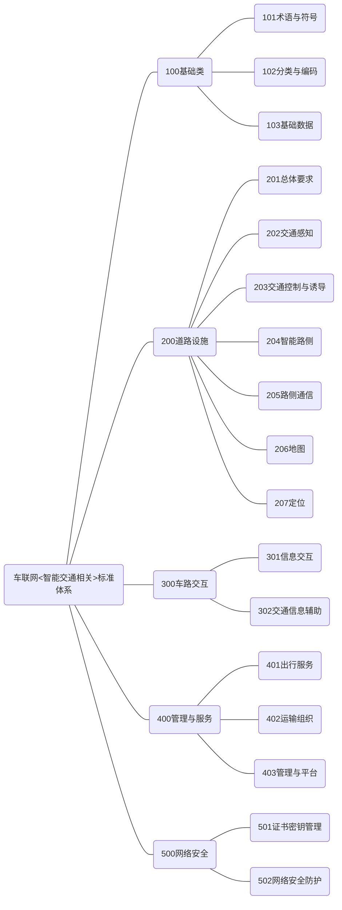

**请注意：**以下内容根据[《国家车联网产业标准体系建设指南（智能交通相关）》（工信部联科〔2021〕23号）](https://www.miit.gov.cn/zwgk/zcwj/wjfb/zh/art/2021/art_a82ea0ba86c04224bc0309cc8ea61056.html)梳理，仅供学习使用。

### 前言

为了加强顶层设计，全面推动车联网产业技术研发和标准制定，推动整个产业的健康可持续发展，工业和信息化部、 国家标准化管理委员会等部门联合组织制定《国家车联网产业标准体系建设指南》（以下简称《建设指南》）。

车联网产业是汽车、电子、信息通信和道路交通运输等行业深度融合的新型产业，是全球创新热点和未来发展制高点。《建设指南》充分发挥标准在车联网产业生态环境构建中的顶层设计和基础引领作用，按照不同行业属性划分为智能网联汽车、信息通信、电子产品与服务、车辆智能管理、 智能交通相关等若干部分，为打造创新驱动、开放协同的车联网产业提供支撑。

为落实《交通强国建设纲要》，促进自动驾驶和车路协同技术应用和产业健康发展，工业和信息化部、交通运输部、 国家标准化管理委员会联合制定了《国家车联网产业标准体系建设指南（智能交通相关）》，主要针对智能交通通用规范、核心技术及关键应用，构建包括智能交通基础标准、服务标准、技术标准、产品标准等在内的标准体系，指导车联网产业智能交通领域的相关标准制修订，充分发挥标准在车联网 产业关键技术、核心产品和功能应用的引领作用，与《建设 指南》其他部分共同形成统一、协调的国家车联网产业标准体系架构。

### 一、总体要求

#### (一)指导思想。

坚持以习近平新时代中国特色社会主义思想为指导，深 入贯彻落实党的十九大和十九届二中、三中、四中、五中全会精神，加快推进交通强国、科技强国、数字中国建设，促进现代科技与交通运输的深度融合，推动先进技术在智能交通领域的应用，发挥标准在推动车联网技术和产业发展中的引领和规范作用，建立健全满足交通运输管理和服务需求的车联网智能交通相关标准体系。

#### (二)基本原则。

**坚持统筹规划。**基于《建设指南》总体架构，结合交通 运输管理和服务工作实际，加强顶层设计，科学确定发展重 点领域，合理规划智能交通相关标准体系结构，满足车联网 产业发展需求及车联网环境下智能交通管理和服务需要。

**坚持需求引导。**结合智能交通技术和产业发展实际，充 分考虑交通安全、运输效率、网络安全、可持续发展等需要, 促进智能交通基础设施建设、智能车辆应用、车路协同、交 通管理和服务系统发展，助力交通强国建设。

**坚持创新驱动。**综合考虑技术成熟程度、市场接受能力、 行业资源优势等因素，合理布局智能交通标准体系建设路 径，充分发挥标准在技术创新路径选择、创新成果转化、产 业整体技术水平提升等方面的规范和引领作用。

**坚持强化实施。**按照“突出重点、急用先行”的思路，加 快重点和急需标准的制定，统筹发挥好产学研用各方、产业 链各环节的力量，加强标准的宣传和培训，共同推动标准实 施，引导企业在研发、生产、管理等环节对标达标。

#### (三)建设目标。

针对车联网技术和产业发展现状、未来发展趋势及智能 交通行业发展实际，聚焦营运车辆和基础设施领域，建立支 撑车联网应用和产业发展的智能交通相关标准体系，分阶段 出台一批关键性、基础性智能交通标准。到2022年底，制 修订智能交通基础设施、交通信息辅助等领域智能交通急需 标准20项以上，初步构建起支撑车联网应用和产业发展的 标准体系；到2025年，制修订智能管理和服务、车路协同 等领域智能交通关键标准20项以上，系统形成能够支撑车 联网应用、满足交通运输管理和服务需求的标准体系。

### 二、构建方法

#### (一)建设依据。

图1为国家车联网产业标准体系建设结构图，清晰地表 明了国家积极引导和推动跨领域、跨行业、跨部门合作的思路，明确了智能交通相关标准体系的定位，以及与其他标准体系部分的关系。

构建科学合理的智能交通相关标准体系，应在国家车联 网产业标准体系整体框架下，充分考虑当前车联网产业发展 水平和趋势、交通运输领域车联网技术应用需求、交通运输 法律法规政策、交通运输路侧设施现状等各方面的因素，根据交通运输发展要求，开展国家和行业标准制修订工作。

主要法律法规和政策依据如下：

1. 《中华人民共和国标准化法》；

2. 《中华人民共和国道路交通安全法》；

3. 中共中央、国务院《交通强国建设纲要》；

4. 交通运输部《数字交通发展规划纲要》；

5. 工业和信息化部、国家标准化管理委员会《国家车联 网产业标准体系建设指南（总体要求）》《国家车联网产业标 准体系建设指南（智能网联汽车）》《国家车联网产业标准体 系建设指南（信息通信）》《国家车联网产业标准体系建设指 南（电子产品与服务）》；

6. 工业和信息化部、公安部、国家标准化管理委员会《国 家车联网产业标准体系建设指南（车辆智能管理）》；

7. 工业和信息化部、公安部、交通运输部《智能网联汽车道路测试管理规范（试行）》；

8. 工业和信息化部《车联网（智能网联汽车）产业发展行动计划》；

9. 国家发展和改革委员会、科学技术部、工业和信息化 部等11个部门《智能汽车创新发展战略》；

10. 工业和信息化部《车联网（智能网联汽车）直连通 信使用5905-5925MHz频段管理规定（暂行）》。

#### （二）技术架构。

车联网产业是依托信息通信技术，通过车内、车与车、 车与路、车与人、车与服务平台的全方位链接和数据交互， 提供安全、智能、舒适、高效的综合服务，形成汽车、电子、信息通信和道路交通运输等行业深度融合的产业形态。车联 网（智能交通相关）技术架构图见图2。

该技术架构图从智能交通基本构成要素出发，考虑车联网环境下人、车、路的协调配合，主要包括以下三个方面：

**1 .智能交通基础设施。**重点是基于道路的交通信息感知、 与车辆协同配合的智能化路侧系统。路侧系统向车辆发送高 精度地理信息、定位辅助信息、交通规则信息、交通环境信 息、基础设施信息、实时交通状态、危险预警提示等，车辆 可以实现精确定位，及时掌握路段层面信息，扩展感知范围。 同时，路侧系统可实现路口、互通区、匝道区及路段范围内 的协同控制，提高车辆在交叉口、合流区、分流区、互通桥 区、关键路段的运行安全和效率。此外，路侧系统将路段层 面的交通状态、交通环境、交通事件等信息反馈至管控中心, 提高全局感知能力。

**2.   车路信息交互。**重点是交通参与者与路侧基础设施的信息交互，将人、车与智能交通基础联系起来，内容包括路侧通信系统、车路信息交互规则等。此外，车辆还向路侧系 统和管控中心反馈其运行信息、异常状态等，提高系统的感知精度和响应速度。

**3.  车联网运输管理与服务。**侧重路网层面宏观信息感知 与服务。信息中心将路网交通状态、路网交通环境、交通控 制及调度、应急处置等信息发送至路侧系统，路侧系统根据 需要，将信息转发至车辆。对全局性的地理数据、气象、事件等信息，信息中心可通过通信网络，直接发送到车辆。

### 三、标准体系主要内容

#### （一）标准体系结构图。

车联网（智能交通相关）标准体系主要包括：基础类标准、道路设施标准、车路交互标准、管理与服务标准、网络安全标准等5部分。标准体系结构图见图3。

图3 车联网（智能交通相关）标准体系结构图

基础类标准为其他4个部分建立信息交互的数据基础标准。道路设施标准立足于道路及附属设施智能化，包括路侧 交通状态感知及事件监测、数字化标志标线、通信设施、高 精度地理信息等。车路交互标准主要对车联网系统中道路与 车辆进行信息交互的相关流程与过程进行标准化规定，是“人-车-路”物理结构中的“粘合剂”，便于车联网系统的互联互 通。管理与服务标准突出“协同服务"理念，面向不同用户， 在不同的时间和空间范围下提供服务。网络安全标准为基于 车路协同的车联网系统提供网络安全防护措施。

#### （二）标准分类说明。

**1.基础类标准**

主要包括术语与符号、分类与编码、基础数据等3类标准。术语与符号主要包括相关术语和图形符号等标准；分类与编码主要包括编码规则、代码结构等标准；基础数据主要包括信息集、数据管理等标准。

**2.道路设施标准**

主要包括总体要求、交通感知、交通控制与诱导、智能 路侧、路侧通信、地图、定位等7类标准。总体要求主要包 括基础设施总体要求、基本要求等标准；交通感知主要包括 监测、传感、检测类标准；交通控制与诱导主要包括车道指 示器、可变限速标志等设施的标准；智能路侧主要包括路侧 边缘计算等设施的标准；路侧通信主要包括道路沿线的通信 设备、通信基站、通信系统等相关标准；地图主要包括与公 路相关的高精度地图应用标准；定位主要包括与公路相关的 高精度定位标准。

**3.车路交互标准**

主要包括信息交互、交通信息辅助等2类标准。信息交互主要包括车联网系统中信息采集、发布、应用集等信息交 互规则的相关标准；交通信息辅助主要包括合作式智能运输系统信息辅助等标准。

**4.管理与服务标准**

主要包括出行服务、运输组织、管理与平台等3类标准。 出行服务主要包括出行信息服务、营运服务等相关标准；运 输组织主要包括车辆编队行驶、营运车辆运输组织类标准； 管理与平台主要包括大数据平台、数据管理中心、云控平台 等标准。

**5.网络安全标准**

主要包括证书密钥管理、网络安全防护2类技术标准。 证书密钥管理类标准主要包括车路信息交互所使用的交通 行业证书、密钥等相关标准；网络安全防护类标准主要包括路侧设施、计算控制中心等进行信息交互过程中的网络安全 防护方法等相关标准。

#### （三）标准体系表。

车联网（智能交通相关）标准体系表见表1，目前初列标准72项，其中国家标准55项，行业标准17项。

表1车联网（智能交通相关）标准体系（略）。

### 四、组织实施

发挥好全国智能运输系统标准化技术委员会等标准化组织作用，充分调动科研院所、行业组织及高等院校等单位 的积极性，加快推动各项标准的制修订工作。

落实好全国智能运输系统标准化技术委员会、全国汽车标准化技术委员会、全国通信标准化技术委员会和全国道路 交通管理标准化技术委员会共同签署的《关于加强汽车、智 能交通、通信及交通管理C-V2X标准合作的框架协议》，加强车联网产业发展中急需的智能交通标准化需求调研分析， 共同推进重点和急需标准的研制。结合车联网技术和产业发 展需求，动态更新和完善标准体系，支撑C-V2X等新技术在 汽车、智能交通及交通管理中的应用。

加强国际交流与合作，支持国内企事业单位参与国际电信联盟（ITU ）、国际标准化组织（ISO ）、国际电工委员会（IEC） 等国际标准化活动，共同制定国际标准。

