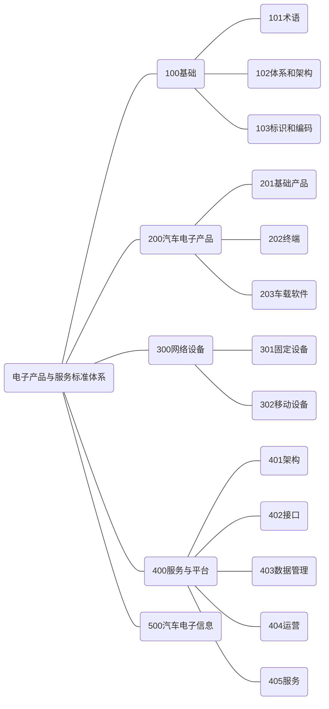

**请注意：**以下内容根据[《<国家车联网产业标准体系建设指南>系列文件》（工信部联科〔2018〕109号）](https://www.miit.gov.cn/zwgk/zcwj/wjfb/zh/art/2020/art_eab131ea349f43c4ba74eaece1377d6f.html)梳理，仅供学习使用。

 

### 前言

 

为了加强顶层设计，全面推动车联网产业技术研发和 标准制定，推动整个产业的健康可持续发展，工业和信息 化部、国家标准化管理委员会联合组织制定《国家车联网 产业标准体系建设指南》（以下简称《建设指南》）。

车联网产业是汽车、电子、信息通信、道路交通运输 等行业深度融合的新型产业，是全球创新热点和未来发展 制高点。《建设指南》充分发挥标准在车联网产业生态环 境构建中的顶层设计和基础引领作用，按照不同行业属性 划分为智能网联汽车标准体系、信息通信标准体系、电子 产品与系统标准体系等若干部分，为打造创新驱动、开放 协同的车联网产业提供支撑。

《国家车联网产业标准体系建设指南（电子产品与服 务）》为《建设指南》第四部分，主要针对电子产品与服 务通用规范、核心技术及关键应用，有目的、有计划、有 重点地指导车联网产业电子产品与服务领域的标准化工 作，加快构建包括汽车电子产品、网络设备、服务平台及 信息安全在内的电子产品与服务标准体系，充分发挥电子 产品与服务标准在车联网产业关键技术、核心产品和功能 应用的基础支撑和引领作用，并逐步形成统一、协调的国 家车联网产业标准体系架构。

### 一、车联网电子产品与服务标准体系总体要求

 

#### （一）指导思想

深入贯彻落实习近平新时代中国特色社会主义思想和 党的十九大精神，加速推进制造强国和网络强国建设，发 挥标准的基础性和引导性作用，促进车联网技术和产业发 展，实现工业化和信息化的高度融合，以满足研发、测 试、示范、运行等需求，推动汽车智能化技术创新发展和 产业转型升级，带动整车制造、信息通信等相关产业协调 发展，建立跨行业、跨领域、适应我国技术和产业发展需 要的车联网电子产品与服务标准体系。

#### （二）基本原则

**立足国情，统筹规划。**结合我国汽车电子产品及服务的技术和产业发展现状及特点，发挥政府主管部门在顶层 设计、组织协调和政策制定等方面的主导作用，制定政府 引导和市场驱动相结合的标准体系建设方案，建立适合我 国国情的车联网电子产品与服务标准体系。

**基础先立，急用先行。**科学确定车联网电子产品与服务标准体系建设的重点领域，加快基础、共性和关键技术 标准的研究制定；考虑行业发展现状和未来应用需求，合 理安排技术标准的制修订工作进度，加快推进急需标准项 目的研究制定。

**创新驱动，市场引导。**顺应先进电子信息技术发展趋 势和市场需求，加强先进电子信息核心关键技术的创新能 力，充分发挥标准在车联网电子产品与服务领域的技术创 新路径选择、创新成果转化等方面的规范和引领作用。

**开放合作，融合发展。**在开放有序的市场环境下，对 车联网中设备、终端、软件、服务等方面进行全面规范， 引导产业结构中各个生产厂家、平台运营商与服务商按照 正确的技术路线进行研制、生产和运营，避免产业中不必 要的重复建设，获得车联网发展中的最优经济效益和社会 效益。

#### （三）建设目标

为建立适应现代电子信息技术和应用服务产业的发展 需要，促进政府主导与市场自主制定标准协同发展，适合 我国国情并与国际接轨的车联网电子产品与服务标准体系。

“十三五”期间电子产品与服务标准体系重点聚焦汽车 电子产品、车载信息系统、移动设备的技术要求和测试标 准，服务平台标准和汽车电子设备安全类标准等。针对车 联网涉及的关键电子产品进行规范，促进车联网产业发 展，提供交通安全保障。2018 年起逐步开展车联网关键电子产品和车载软件的标准制定工作，完成汽车电子产品与服务终端、安全等领域的关键技术标准和应用，完成车载 信息服务、平台接口、数据管理等相关标准的制定；2020 年完成汽车电子产品与服务平台的关键技术标准及测试标 准，建立汽车智能终端的安全和质量认证标准体系，推动 车联网服务平台标准在产业中的实际应用。

### 二、车联网电子产品与服务标准体系建设思路

 

#### （一）建设思路

 

图 1 为车联网电子产品与服务分标准体系在国家车联网标准体系中的位置以及与其他分标准体系间的关系。车联网电子产品与服务标准体系以新兴的电子产品和车载信息系统为承载，同时融合先进移动设备的辅助功能，构建车联网大数据与服务平台。车联网电子产品与服务标准体系的构建是一个不断完善和调整的动态过程，形成一种持续更新和协商讨论的工作机制。通过标准制定和研发，为我国车联网电子产品与服务产业发展提供技术支撑，规范和引导产业发展。

#### （二）技术结构图

 

 

从技术和产业链的角度分析，车联网电子产品与服务包括基础产品、终端、网络、平台与服务等。车联网基础 产品和终端是实现车联网的实体，通过基础产品和终端采 集并获取车辆的智能信息，感知并处理行车状态与环境， 实现交通信息、导航服务、娱乐信息、安全行驶、在线商务、排放信息、远程控制、道路救援、灾害救援、车辆配 置、检验维修等方面的车载信息服务。

### 三、车联网电子产品与服务标准体系建设内容

 

#### （一）标准体系结构图

 

 

 

 

#### （二）标准分类说明

电子产品与服务标准体系主要包括基础、汽车电子产 品、网络设备、服务与平台、网络与信息安全等标准。

**1.** **基础标准**

基础类标准主要包括术语、汽车电子新型体系架构、 标识和编码等标准。术语标准为其他各部分标准的制定提 供支撑。体系架构主要规范信息服务的体系框架，明确其 边界及各部分的层级关系和内在联系；标识和编码可以支 持对车载终端设备的辨识、寻址、路由和访问。

**2.** **汽车电子产品标准**

汽车电子产品是指智能网联汽车、车联网和车载信息 服务中，具备感知、计算、反馈、控制、执行、通信、应 用等功能，实现信息感知、高速计算、状态监测、行为决 策和整车控制的基础电子产品。主要包括基础产品、终端 和软件等标准。基础产品标准包括车规级功率器件、车规 级集成电路、车规级传感器、高性能计算芯片等；终端标 准指车载计算机、导航设备、信息娱乐终端等；软件标准 包括车载操作系统、算法软件、应用软件等。

**3.** **网络设备标准**

网络设备类标准主要包括固定设备和移动设备两个领 域的标准。固定设备主要指路边单元、云平台设备等。移 动设备类标准主要指各类车载设备和手持移动设备，主要 包括：新型总线、车载电子设备、手持分析仪等。

**4.** **服务平台标准**

车载服务平台包括平台的架构、接口、数据管理、运 营以及信息服务五个方面的标准。平台架构主要确定平台 基本架构规范；平台接口规定了平台与终端、平台间、平 台与上层管理系统等方面的接口标准；平台数据管理包括 数据接口、数据管理和大数据应用方面的要求和规范；平 台运营主要规定了平台运营功能要求；信息服务包括云服 务、地理信息和位置导航服务、运维服务、辅助/自动驾驶服务、紧急救援服务、道路交通信息服务、车载广播服务 等标准。

**5.** **汽车电子信息安全标准**

汽车电子信息安全类标准指汽车电子产品的入侵检测 防护、访问控制、安全通信、安全态势感知等相关技术标 准，包括车载系统安全、车载终端安全、车载信息与服务 安全、应用软件和服务运营平台安全、车载操作系统在线 升级安全等标准。

#### （三）车联网电子产品与服务标准体系表

 （略）

 

### 四、组织实施

落实部《车联网创新发展工作方案》等文件部署，以《国家车联网产业标准体系建设指南》为总纲，以电子信 息技术与车联网的融合为切入点，加快关键技术和应用标 准建设，积极参与国际标准制定，为规范车联网市场，培 育产业发展提供指导。

在车联网部际协调机制下，加强沟通协作，由中国电 子技术标准化研究院、车载信息服务产业应用联盟牵头， 联合中国通信标准化协会、中国汽车技术研究中心等标准 化组织组成工作推进组。在总体统筹的基本原则下，根据 产业发展情况和未来需求，不断更新、完善电子产品与服 务标准体系，有序推进相关标准化工作。

同时，发挥产业联盟在行业和市场中先行先试，推动 各种团体标准的有效实施与应用。加强国际交流，定期举 办车联网标准国际论坛，组织中外企业和标准化组织开展 交流合作。积极参与国际标准化组织（ISO）、国际电信 联盟（ITU）、国际电工技术委员会（IEC）等相关国际标 准化组织的标准制定工作。