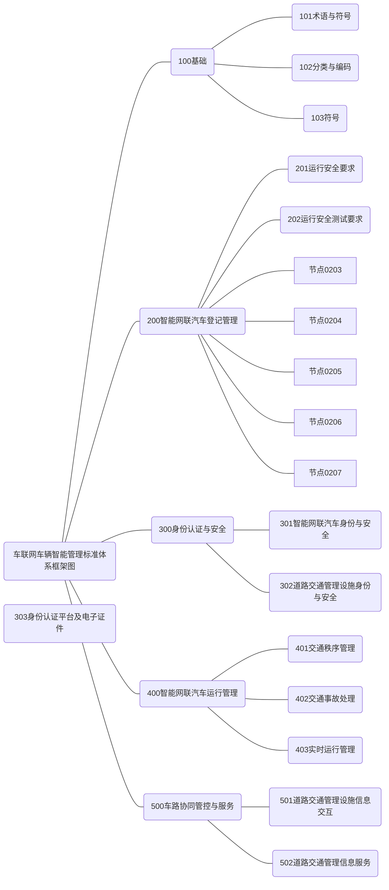

**请注意：**以下内容根据[《国家车联网产业标准体系建设指南（车辆智能管理）》（工信部联科〔2020〕61号）](http://www.samr.gov.cn/bzjss/tzgg/202004/t20200424_314631.html)梳理，仅供学习使用。

### 前 言

为加强顶层设计，全面推动车联网产业技术研发和标准制定，推动整个产业的健康可持续发展，工业和信息化部、国家标准化管理委员会等部门联合组织制定《国家车联网产业标准体系建设指南》（以下简称《建设指南》)。

车联网产业是汽车、电子、信息通信、道路交通运输等 行业深度融合的新型产业，是全球创新热点和未来发展制高点。《建设指南》充分发挥标准在车联网产业生态环境构建 中的顶层设计和基础引领作用，按照不同行业属性划分为智能网联汽车、信息通信、电子产品与服务、车辆智能管理等若干部分，为打造创新驱动、开放协同的车联网产业提供支 撑。

工业和信息化部、公安部、国家标准化管理委员会联合组织制定的《国家车联网产业标准体系建设指南(车辆智能管理)》，主要针对车联网环境下的车辆智能管理工作需求，指导智能网联汽车登记管理、身份认证与安全、道路运行管理及车路协同管控与服务等领域标准化工作，推动公安交通管理领域车联网技术应用与发展，提升我国智能网联汽车与智慧交通水平，并逐步与《建设指南》其它部分共同形成统一、 协调的国家车联网产业标准体系架构。

### 一、总体要求

#### （一）指导思想

深入贯彻落实习近平新时代中国特色社会主义思想和党的十九大精神，聚焦国家交通强国、科技强国、数字中国、 智慧社会战略，发挥标准的基础性和引导性作用，满足车联网环境下的车辆智能管理工作需求，加快推进现代科技与交通管理的深度融合，促进车联网技术和产业发展，建立适应我国技术和产业发展需要的车辆智能管理标准体系。

#### （二）基本原则

**坚持统筹规划。**加强车辆智能管理标准体系顶层设计，基于《国家车联网标准体系建设指南（总体要求）》，结合公 安交通管理工作实际，科学确定发展重点领域，合理规划车辆智能管理标准体系结构，满足车联网产业发展需求及车联网环境下车辆管理需要，保障道路交通有序安全畅通。

**坚持创新驱动。**强化以车联网科技创新为动力，推进科技研发、标准研制和服务公安机关交通治理能力、服务群众能力跨越式发展，提升车辆智能管理标准化水平，加大标准实施、监督和服务力度，提高标准化效益。

**坚持实战引领。**坚持突出重点、急用先行的原则，以解决实际问题为切入点，以保障车联网技术落地应用为着力点， 以提升车辆智能管理能力为落脚点，优先制修订保障车联网 城市级验证示范、智能网联汽车道路测试等工作的相关标准。

#### （三）建设目标

针对车联网产业发展技术现状、未来发展趋势及道路交通管理行业应用需求，分阶段建立车辆智能管理标准体系： 到 2022 年底，完成基础性技术研究，制修订智能网联汽车登记管理、身份认证与安全等领域重点标准 20 项以上，为开展车联网环境下的智能网联汽车道路测试、车联网城市级验证示范等工作提供支撑；到 2025 年，系统形成能够支撑车联网环境下车辆智能管理的标准体系，制修订道路交通运行管理、车路协同管控与服务等业务领域重点标准 60 项以上。

### 二、构建方法

#### （一）建设依据

《中华人民共和国道路交通安全法》第八条规定：“机动车经公安机关交通管理部门登记后，方可上道路行驶”。车辆管理是公安交通管理的重要组成部分，具有社会性、服务性和技术性等基本属性，具体工作内容为拟订相关政策、法规， 开展机动车登记、检验合格标志核发，协同有关部门监督机动车安全技术检验等。构建科学、合理的车辆智能管理标准体系应在国家车联网产业标准体系整体框架下（详见图 1），充分考虑当前车联网产业发展水平和趋势、公安交通管理领域车联网技术应用需求、道路交通管理法律法规政策、道路交通管理设施现状、交通参与者行为等方面影响，满足公安交通管理工作实际需求。

主要法律法规和政策依据：

1. 《中华人民共和国标准化法》；

2. 《中华人民共和国道路交通安全法》；

3. 《中华人民共和国道路交通安全法实施条例》；

4. 《城市道路交通管理条例》；

5. 工业和信息化部、国家标准化管理委员会《国家车联网产业标准体系建设指南（总体要求）》、《国家车联网产业 标准体系建设指南（智能网联汽车）》、《国家车联网产业标 准体系建设指南（信息通信）》、《国家车联网产业标准体系 建设指南（电子产品与服务）》；

6. 工业和信息化部、公安部、交通运输部《智能网联汽车道路测试管理规范(试行)》；

7. 工业和信息化部《车联网（智能网联汽车）产业发展行动计划》。

#### （二）构建思路及架构

车联网产业是依托信息通信技术，通过车内、车与车、车与路、车与人、车与服务平台的全方位连接和数据交互， 提供综合信息服务，形成汽车、电子、信息通信、道路交通运输等行业深度融合的新型产业形态。智能网联汽车是车联网运行的主要载体，是指搭载先进的车载传感器、控制器、执行器等装置，并融合现代通信与网络技术，实现车与 X（人、车、路、云端等）智能信息交换、共享，具备复杂环境感知、 智能决策、协同控制等功能，可实现“安全、高效、舒适、节能”行驶的新一代汽车。车联网环境下的车辆智能管理主要指公安交通管理部门针对智能网联汽车开展的车辆管理、驾驶人管理、道路通行秩序管理、道路交通事故处理等道路交通管理工作。

构建车辆智能管理标准体系的思路是:围绕道路交通管 理中心工作，以推动车联网技术在公安交通管理领域应用、保障车联网智能网联汽车运行安全为核心，提出智能网联汽车登记管理、身份认证与安全、道路运行管理及车辆协同管控与服务等领域国家、行业标准（标准架构体系见图 2）。其中，开展登记管理是智能网联汽车运行安全测试和上道路行驶的基本前提；在车联网环境中，车辆及其驾驶人、道路交通管理设施具有数字身份并对其进行验证是确保信息交互 及安全的关键环节；针对智能网联汽车开展道路通行秩序管理、道路交通事故处理等道路运行管理工作是车辆智能管理的核心所在；车路协同管控与服务工作是支撑车联网技术在道路交通管理领域应用的根本保障。

 

《国家车联网产业标准体系建设指南（总体要求）》对 车辆智能管理部分的框架和内容进行了界定，主要包括车辆智能管理基础标准、产品类标准、安全类标准和智能网联汽车运行安全测试与规范管理标准等 4 大类。随着车联网产业的不断发展，公安交通管理部门开展车辆智能管理工作的领域、范围和方向进一步清晰和明确，拟归口制修订的相关标 准主要定位于支撑智能网联汽车的运行安全管理，以管理类标准为主。同时，随着《国家车联网产业标准体系建设指南（智能网联汽车）》、《国家车联网产业标准体系建设指南（信息通信）》、《国家车联网产业标准体系建设指南（电子产品与服务）》相继发布，车辆智能管理部分的架构进一步明确： 保留基础标准类别；细分智能网联汽车运行安全测试与规范管理类别，调整为智能网联汽车登记管理、身份认证与安全、 智能网联汽车运行管理、车路协同管控与服务等 4 类；车辆智能管理产品、安全标准不再单设类别，相关标准分别列入智能网联汽车登记管理、身份认证与安全、智能网联汽车运行管理、车路协同管控与服务类别。

### 三、标准体系

#### （一）标准体系结构图

车辆智能管理标准体系主要包括基础标准、智能网联汽车登记管理、身份认证与安全、智能网联汽车运行管理、车路协同管控与服务标准等5 部分，如图3 所示。

图3 车辆智能管理标准体系框架图

#### （二）标准分类说明

**1.** **基础标准**

基础类标准为其它各部分标准的制修订提供支撑，主要包括术语和定义、分类和编码、符号等 3 类标准。

**（1） 术语和定义。**车辆智能管理术语和定义标准用于统一相关的基本概念，为各相关行业协调兼容奠定基础。

**（2） 分类和编码。**分类和编码标准用于支持对道路交 通管理基础信息的存储、传输、辨识和访问，主要包括道路交通管理设施分类与编码、道路交通事件分类与编码等标准。

**（3） 符号。**符号标准用于对道路交通管理设施、道路交通事件等进行标识与解析。

**2.** **智能网联汽车登记管理**

支撑智能网联汽车运行安全测试、公安交通管理部门开展智能网联汽车登记、在用车定期安全技术检验等安全管理工作，包括运行安全要求、运行安全测试要求 2 类标准。

**（1）** **运行安全要求。**指智能网联汽车在公共道路行驶必需的登记检验等管理要求，包括需符合的运行安全技术条件、安全技术检验要求、查验工作规程等相关标准。

**（2）** **运行安全测试要求。**指智能网联汽车运行安全测试涉及的测试项目和方法、道路环境、测试场地等相关要求， 包括测评阶段所需要的测试环境、测试项目、场景设置、评测规范及车载终端等相关标准。

**3.** **身份认证与安全**

在车联网环境下，智能网联汽车身份认证主要支撑智能 网联汽车和道路交通管理系统、设施之间身份互认，主要包 括智能网联汽车身份与安全、道路交通管理设施身份与安全、身份认证平台及电子证件等 3 类标准。

**（1）** **智能网联汽车身份与安全。**使用可信的数字身份标识智能网联汽车真实身份，主要包括智能网联汽车数字身份编码规范、智能网联汽车数字身份通用技术规范等标准。

**（2）** **道路交通管理设施身份与安全。**车联网环境下，需要安装专用识读设备，读取或写入智能网联汽车相关身份信息；接入车联网的道路交通管理设施需加注数字身份，设施与设施、设施与系统之间需进行身份互认。主要包括道路 交通管理设施数字身份通用技术规范、机动车电子证件识读设备通用技术规范等标准。

**（3）** **身份认证平台及电子证件。**身份认证平台主要提供身份注册、身份认证、身份注销等身份管理服务，提供密钥分发管理及证书管理功能。身份认证平台包含智能网联汽车电子证件发行管理系统，用于管理电子证件发行，提供电子证件相关应用服务。主要包括机动车身份认证系统技术要求、机动车身份认证系统服务接口规范、密钥分发管理系统 技术要求等标准。

**4.** **智能网联汽车运行管理**

智能网联汽车运行管理标准主要支撑公安交通管理部 门依法对上道路行驶智能网联汽车进行管理，主要包括交通秩序管理、交通事故处理和实时运行管理等 3 类标准。

**（1）** **交通秩序管理。**针对上道路行驶智能网联汽车，公安交通管理部门可基于车联网信息技术进行违法取证、执法，主要包括智能网联汽车违法取证规范、违法行为监测记录系统通用技术条件、智能网联汽车公共道路运行示范管理规范等标准。

**（2）** **交通事故处理。**针对涉及智能网联汽车的交通事故，公安交通管理部门可基于新技术开展车辆检验、检验鉴 定等事故处理工作，主要包括智能网联汽车交通事故仿真技术规范、智能网联汽车交通事故调查规范等标准。

**（3）** **实时运行管理。**通过建立智能网联汽车道路交通管理运行监管平台，对智能网联汽车运行安全开展实时管理， 主要包括智能网联汽车道路交通管理平台通用技术要求、智能网联汽车道路交通管理平台安全保护通用技术要求等标准。

**5.** **车路协同管控与服务**

车路协同管控与服务标准主要支撑车联网环境下道路 交通管理设施信息交互及基于道路交通管理相关信息系统 提供信息服务。主要包括道路交通管理设施信息交互、道路交通管理信息服务2 类标准。

**（1）** **道路交通管理设施信息交互。**道路交通管理设施按照应用类型划分为信号管控、交通标志标线、安全设施、交通执法、信息采集、信息发布与诱导以及面向车联网/车路协同的新型设施等类别。道路交通管理设施基于车联网短程直接通信技术，与智能网联汽车进行直接信息交互，支撑各 类车联网应用场景。主要包括道路交通信号控制机信息交互 接口规范、道路交通违法监测设施信息发布接口规范等标准。

**（2）** **道路交通管理信息服务。**道路交通管理信息系统包括道路交通信号管控、道路交通违法取证、交通管理综合 应用、指挥调度等系统及面向车联网的应用服务平台。在车 联网环境下，公安交通管理信息系统面向行业外车联网平台、管理平台、智能网联汽车企业管理平台进行系统层面的信息 交互，开放涵盖人、车、路的各类交通管理数据，面向交通 参与者提供道路交通通行与信息服务，并采集各行业平台内 部的交通信息，进行信息汇聚融合，支撑公安交通管理业务。

#### （三）标准体系表

（略）

 

### 四、组织实施

成立“全国道路交通管理标准化技术委员会车辆智能管理工作组”，构建以道路交通管理行业为主、相关产业协同的标准协调工作机制，确保车辆智能管理标准体系建设工作“顶层设计科学、层次结构清晰、职责范围明确、合作协调顺畅”。发挥道路交通管理部门及相关行业企业在标准制定过程中的主体作用，调动地方主管部门、行业组织和高等院校等的积极性，加快推动各项标准的制修订工作。

分析现行标准法规中与车联网车辆智能管理相关的条款，逐步消除制约汽车新技术发展的标准法规障碍;推动自动驾驶技术产品示范应用，营造智能网联汽车发展良好政策环境。

加强交流与合作，落实好全国道路交通管理标准化技术委员会、全国汽车标准化技术委员会、全国智能运输系统标准化技术委员会和全国通信标准化技术委员会联合签署的《关于加强汽车、智能交通、通信及交通管理 C-V2X 标准合作的框架协议》，建立高效顺畅的沟通交流机制，相互支持和参与标准研究制定，共同推动 C-V2X 等新一代信息通信技术在汽车、智能交通以及交通管理中的应用。

根据车联网未来技术和应用的多样性及发展需求，实施动态更新完善机制，通过持续强化部门和行业间的协调、协作，不定期地更新与完善车辆智能管理标准体系。

