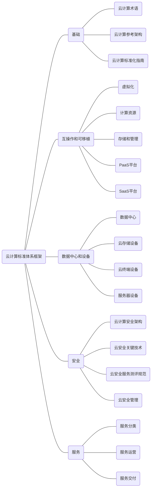

>  来源：高林等，云计算技术与标准化，电子工业出版设，2013.09

针对目前云计算迅速发展面临的挑战，结合用户需求、国内外云计算应用情况和技术发展状况，建议云计算标准体系从基础标准、软件技术和产品、设备和系统标准、安全标准和服务标准5个方面展开，具体框架如图所示。

```mermaid
graph LR
	节点0(云计算标准体系框架)
	节点01(基础)
	节点02(互操作和可移植)
	节点03(数据中心和设备)
	节点04(安全)
	节点05(服务)
	节点0101(云计算术语)
	节点0102(云计算参考架构)
	节点0103(云计算标准化指南)
	节点0201(虚拟化)
	节点0202(计算资源)
	节点0203(存储和管理)
	节点0204(PaaS平台)
	节点0205(SaaS平台)
	节点0301(数据中心)
	节点0302(云存储设备)
	节点0303(云终端设备)
	节点0304(服务器设备)
	节点0401(云计算安全架构)
	节点0402(云安全关键技术)
	节点0403(云安全服务测评规范)
	节点0404(云安全管理)
	节点0501(服务分类)
	节点0502(服务运营)
	节点0503(服务交付)
	
	节点0---节点01
	节点0---节点02
	节点0---节点03
	节点0---节点04
	节点0---节点05
	节点01---节点0101
	节点01---节点0102
	节点01---节点0103
	节点02---节点0201
	节点02---节点0202
	节点02---节点0203
	节点02---节点0204
	节点02---节点0205
	节点03---节点0301
	节点03---节点0302
	节点03---节点0303
	节点03---节点0304
	节点04---节点0401
	节点04---节点0402
	节点04---节点0403
	节点04---节点0404
	节点05---节点0501
	节点05---节点0502
	节点05---节点0503
	
```

图  云计算标准体系框架

