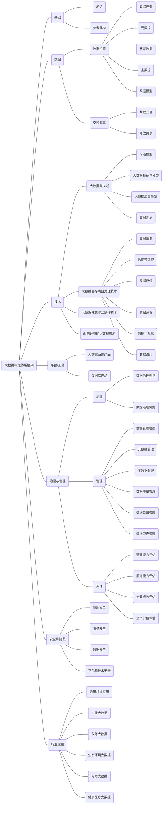

>  来源：大数据标准化白皮书（2020 版）全国信息技术标准化技术委员会大数据标准工作组、中国电子技术标准化研究院，二零二零年九月

图  大数据标准体系框架图

大数据标准体系由7 个类别标准组成，分别为基础标准、数据标准、技术标准、平台/工具标准、治理与管理标准、安全和隐私标准、行业应用标准。

（1）基础标准

基础标准为大数据其他部分的标准制定提供基础遵循，支撑行业间对大数据达成统一理解，主要包括术语、参考架构类标准。

（2）数据标准

数据标准主要针对底层数据相关要素进行规范，包括数据资源和交换共享两类。其中数据资源标准面向数据本身进行规范，包括数据元素、元数据、参考数据、主数据、数据模型等标准；交换共享标准面向数据流通相关技术、架构及应用进行规范，包括数据交易和开放共享标准。

（3）技术标准

技术标准主要针对大数据通用技术进行规范。包括大数据集描述、大数据生存周期处理技术、大数据开放与互操作技术、面向领域的大数据技术四类。其中，大数据集描述标准主要针对多样化、差异化、异构异质的不同类型的数据建立标准的度量方法，以衡量数据质量；大数据生存周期处理技术标准主要针对大数据产生到其使用终止这一过程的关键技术进行标准制定，包括数据采集、数据预处理、数据存储、数据分析、数据可视化、数据访问等标准；大数据开放与互操作标准主要针对不同功能层次功能系统之间的互联与互操作机制、不同技术架构系统之间的互操作机制、同质系统之间的互操作机制等相关标准以及通用数据开放共享技术框架等标准进行研制；面向领域的大数据技术标准主要针对电力行业、医疗行业、电子政务等领域或行业的共性且专用的大数据技术标准进行研制。

（4）平台/工具标准

平台/工具标准主要针对大数据相关平台及工具产品进行规范，包括大数据系统产品和数据库产品。其中大数据系统产品标准主要针对业内主流的用于实现数据全生存周期处理的大数据产品的功能和性能进行规范；数据库产品标准则主要面向不同类型的数据库的功能和性能进行要求。此外，该类标准还包括相关产品功能及性能的测试方法和要求。

（5）治理与管理标准

治理与管理标准贯穿于数据生存周期的各个阶段，是大数据实现高效采集、分析、应用、服务的重要支撑。该类标准主要包括治理标准、管理标准和评估标准三部分。其中，治理标准主要对数据治理的规划和具体实施方法进行标准研制；管理标准则主要面向数据管理模型、元数据管理、主数据管理、数据质量管理、数据目录管理以及数据资产管理等理论方法和管理工具进行规范；评估标准则在治理标准和管理标准的基础上之上，总结形成针对数据管理能力、数据服务能力、数据治理成效、数据资产价值的评估方法。

（6）安全和隐私标准

数据安全和隐私标准同样贯穿于整个数据生存周期的各个阶段，主要包括应用安全、数据安全、服务安全、平台和技术安全四部分。其中，应用安全主要对大数据与其他领域融合应用中存在的安全问题进行规范；数据安全主要围绕个人信息安全、重要数据安全以及跨境数据安全标准进行研制，保障数据主体所拥有数据不被侵害；服务安全主要包括数据安全治理、服务安全能力和交换共享安全，面向数据产品和解决方案的安全性进行要求；平台和技术安全则针对大数据平台，以及以大数据平台为底座的应用平台的系统安全、接口安全、技术安全进行标准研制。

（7）行业应用标准

行业应用标准主要面向通用领域应用以及工业、政务、电力、生态环境等垂直行业领域应用开展标准研制。通用领域应用标准主要从大数据在通用领域中所能提供的共性服务出发，开展应用方法、能力评估等标准研制；垂直行业应用标准主要从大数据为各个垂直行业所能提供的服务角度出发，是各领域根据其领域特性产生的专用数据标准，包括工业大数据、政务大数据、电力大数据、生态环境大数据等领域应用标准。