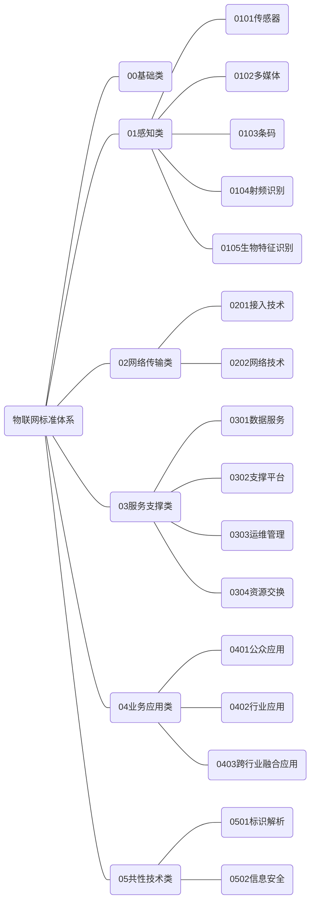

>  来源：《物联网标准化白皮书》中国电子技术标准化研究院国家物联网基础标准工作组2016年1月

物联网标准体系的建立应遵照全面、明确、兼容、可扩展的原则。在全面综合分析物联网应用生态系统设计、运行涵盖领域基础上，将物联网标准体系划分为六个大类，分别为基础类、感知类、网络传输类、服务支撑类、业务应用类、共性技术类。

```mermaid
graph LR
	节点0(物联网标准体系)
	节点00(00基础类)
	节点01(01感知类)
	节点02(02网络传输类)
	节点03(03服务支撑类)
	节点04(04业务应用类)
	节点05(05共性技术类)
	节点0101(0101传感器)
	节点0102(0102多媒体)
	节点0103(0103条码)
	节点0104(0104射频识别)
	节点0105(0105生物特征识别)
	节点0201(0201接入技术)
	节点0202(0202网络技术)
	节点0301(0301数据服务)
	节点0302(0302支撑平台)
	节点0303(0303运维管理)
	节点0304(0304资源交换)
	节点0401(0401公众应用)
	节点0402(0402行业应用)
	节点0403(0403跨行业融合应用)
	节点0501(0501标识解析)
	节点0502(0502信息安全)
	
	节点0---节点00
	节点0---节点01
	节点0---节点02
	节点0---节点03
	节点0---节点04
	节点0---节点05
	节点01---节点0101
	节点01---节点0102
	节点01---节点0103
	节点01---节点0104
	节点01---节点0105
	节点02---节点0201
	节点02---节点0202
	节点03---节点0301
	节点03---节点0302
	节点03---节点0303
	节点03---节点0304
	节点04---节点0401
	节点04---节点0402
	节点04---节点0403
	节点05---节点0501
	节点05---节点0502
	
```

图  物联网标准体系框架

