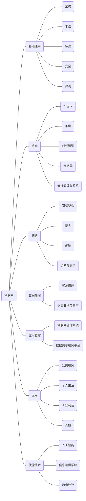

>  来源：物联网标准化指南，赵波，程多福，张涌 等，电子工业出版社，2021年1月

物联网标准体系框架包括基础通用、感知、网络、数据处理、应用支撑、应用和使能技术七大类标准。

图  物联网标准体系框架

## 1. 基础通用标准

基础通用标准主要从整体架构和信息资源管理角度，统一对物联网的认识，规范物联网的基本术语、顶层技术需求、通用参考模型（与具体行业应用无关）、性能评估等基本要素，为其他各类标准提供参考与指导。物联网基础通用技术不属于物联网技术的某个特定层面，而是与物联网技术架构的4个层面都有关系。物联网基础通用标准包括架构、术语、标识、安全和评测等标准，主要负责系统整体架构的顶层设计，为其他各层设计提供整体参考和指导，是整个物联网标准体系的支撑基础。

（1）架构标准用于明确和界定物联网的对象、边界、各部分的层级关系和内在联系，包括物联网总体架构、通用分层模型、核心功能，以及物联网共性能力技术要求等。

（2）术语标准用于统一物联网主要概念，为其他物联网相关标准中的术语定义提供依据和参考。其主要涉及物联网领域下场景、技术、业务等主要概念的分类和汇总、新概念定义、旧术语完善、相近概念辨析等。

（3）标识标准用于在全局范围内唯一识别物联网中的物理和逻辑实体、资源、服务，使网络、应用能够对其目标对象进行控制和管理，以及进行相关信息的获取、处理、传送与交换。物联网标识体系包括标识和解析两部分，标识实现编码标识符注册分配功能，解析实现对分布式数据库元数据的查询功能。

（4）安全标准用于确保信息的安全性和隐私性，防止个人信息、业务信息和财产丢失或被他人盗用。物联网安全技术标准包括物联网应用安全，物联网服务支撑安全，移动通信网、互联网和其他专用网安全，感知层通信和信息处理安全，感知层终端和设备安全等。

（5）评测标准包括一致性评测、互操作性评测和系统评测。一致性评测是指测试系统与协议规范的符合程度，也就是测试一个协议给定实现的外部行为是否符合协议规范；互操作性评测是指测试一个系统的各个层次之间是否能够交互及交互程度；系统评测指对整个系统的硬件、软件等进行评测，检验它们是否符合标准。

## 2. 感知标准

感知标准主要从全面感知现实世界中各种信息的角度考虑，统一对物联网感知层涉及的各种技术的认识。感知层基于物理、化学、生物等技术和发明相关的传感器，感知层关键技术的标准化为其他标准提供总体参考，包括传感器网络标准、射频识别（RFID）标准等。

（1）智能卡标准主要用于规范智能卡的物理特性、接口规范、传输协议、命令交换格式、编号体系、数据结构、测试要求等。

（2）条码标准主要用于规范条码的编码规则、编码方式、条码尺寸、条码标签设计、条码符号位置要求等。

（3）射频识别（RFID）标准的目标是为用户提供及时、准确、方便的分类信息，甚至是单件物品信息，以完善、先进的基础设施和技术装备为基础，利用信息技术整合资源，实现各种服务功能，用于解决编码、通信、接口和数据共享等问题。

（4）传感器网络标准针对物联网感知层共性需求和特定应用提出，现已基本确定了“共性平台+应用子集”的传感器网络标准体系。该体系较好地分离了各类不同的传感器网络应用之间的共性技术特征和差异性，为形成统一体系的传感器网络标准提供了很好的解决思路。

（5）音视频采集系统标准主要用于规范音视频编码方案设计、音视频编程接口选择、服务器功能等。

## 3. 网络标准

网络标准主要用于规定网络技术在物联网承载网络中的实际应用，统一对物联网中网络技术的认识，实现对支撑网络中技术的分类研究，规范网络架构与组网融合的概念，区分网络传送的接入与传输部分，为感知层与数据处理层标准的制定提供指导，使层次之间可以更好地衔接。

（1）网络架构标准用于规范物联网中网络的拓扑结构。网络架构是网络层的底层技术，用于物联网底层与高层通信；各层中的协议和层次之间接口的集合，规定了网络层与感知层、数据处理层的网络技术标准。其拓扑结构包括接入网络和传输网络。

（2）接入标准用于区分网络结构中功能不同的各部分，并且连接物联网底层与网络层。目前，无线接入技术、光纤接入技术等较为常用，通用协议有IEEE802.15.4标准、Zigbee标准、移动通信协议等。

（3）传输标准作用与接入标准类似，用于区分不同部分的功能。区别在于其连接网络层与数据处理层，使用的网络也不同。网络主要包括移动通信网、互联网、专用网等，用于将底层数据传递至高层处理。

（4）组网与融合标准用在网络的接入与传输中，针对不同的组网类型及数据类型，进行网络融合，使数据在一条链路中就可以访问不同的局域网，传输不同的数据、文字、语音或图像。

## 4. 数据处理标准

数据处理标准主要是从资源分类和数据融合的角度，对数据参考模型进行统一，使不同类型的数据得到统一处理，以便于感知层获得有效、完整的数据资源。数据处理标准主要包括资源描述标准、信息交换与共享标准。

（1）资源描述标准明确物联网中数据的类型、存储方式、组织结构及时效性等特征，便于从跨域、异构、动态、海量的数据资源中提取用户所需的知识，将多源异构的数据资源有效地聚合在一起，提供统一的数据操作方法。

（2）信息交换与共享标准用于规范数据融合，根据物联网中海量数据的特点及融合的目标，分别从数据级、特征级、决策级3个方面进行融合。数据级融合是最低层次的融合，是在各传感器的原始数据未经预处理之前就进行的数据综合和分析。特征级融合是指从各个传感器提供的原始数据中提取特征，然后对这些特征进行融合。决策级融合是指将单个传感器做出的决策进一步融合，为指挥控制决策提供依据。

## 5. 应用支撑标准

（1）物联网操作系统标准主要规范物联网的网络架构和标识解析，如信息物理系统（CPS）技术标准用于规范物联网的总体框架，主要包含嵌入式计算、通信系统和自动控制的实时性等标准。

（2）数据共享服务平台标准主要包括物联网网络管理平台标准、物联网网络延伸终端远程管理技术标准、物联网安全防护系列标准、物联网安全防护评估测试标准。例如，边缘计算标准用于指导行业数字化转型、数字化创新，解决物联网行业数字化在安全和隐私保护等方面的关键需求，包括架构、技术要求、存储安全等标准。

## 6. 应用标准物

联网应用层主要根据业务领域内的具体应用需求处理各种差异化的业务流程和业务信息，涉及的应用标准主要从各业务领域、各行业应用的角度，参考总体性标准和通用技术标准，对物联网典型应用领域所需标准进行规范，主要包括工业互联网、车联网、智慧农业、智慧物流、智慧能源、智慧环保、智慧医疗、智慧城市及其他行业领域等。

（1）公共服务标准主要用于规范物联网公共服务领域总体技术标准、联网技术标准、公共服务设备控制协议技术标准等。

（2）个人生活标准主要用于规范面向个人生活的智能交通、智能电力、智能环境等相关系列标准，这些标准与人类的生活和环境息息相关。

（3）工业制造标准主要用于规范工业制造领域物联网信息开放控制平台基本能力标准、物联网信息开放控制平台总体功能架构标准、信息服务发现平台标准、信息处理和策略平台标准等。

## 7. 使能技术标准

物联网产业的发展离不开使能技术的支撑，物联网使能技术跨越基础研究和产品研发两部分，属于应用研究的范畴。通过人工智能、边缘计算等使能技术的创新，可推动物联网行业创新链下游的产品开发、产业化等环节的实现，目前使能技术主要包括人工智能、信息物理系统（CPS）、边缘计算等新兴技术。

（1）人工智能技术标准用于规范人工智能基础通用、互联互通、安全隐私、行业应用、评测等技术标准，主要包括基础、平台/支撑、关键技术、产品及服务、应用、安全/伦理6个部分。

（2）CPS技术标准用于规范信息物理系统的基本框架、概念模型、参考架构、用户案例、信息物理系统行业标准等，主要包括嵌入式计算、通信网络、自动控制的实时性、数据、系统特征、决策融合、安全、智能制造等标准。

（3）边缘计算标准用于指导行业数字化转型、数字化创新，解决物联网行业数字化在敏捷连接、实时业务、数据优化、应用智能、安全与隐私保护等方面的关键需求，包括架构与技术要求、计算及存储、安全、应用和其他标准。