知识图谱标准体系框架，有利于围绕知识图谱技术研究及应用的标准化工作开展，面向市场和技术发展需求逐步开展相关标准化工作。同时，做好总体设计和布局，加强基础共性标准的研制，形成系列协调配套的关键标准，提升我国知识图谱标准的先进性和国际竞争力。

## 1、知识图谱标准体系结构

知识图谱标准体系结构包括**“A 基础共性”、“B 数字基础设施”、“C 关键技术”、“D 产品/服务”、“E 行业应用”、“F 运维/安全”**等六个部分，主要反映标准体系各部分的组成关系，如图所示。

**基础共性标准**包括术语和定义、参考架构、数据、管理、测试评估等标准，规范了知识图谱技术领域中的专业术语及术语间的关系，提出了参考架构，并明确了知识图谱输入数据、管理、测试评估等方面的要求。基础共性标准为体系结构中的其他部分提供支撑，有助于准确理解知识图谱技术内容并促进技术交流和研究。

**数字基础设施标准**主要针对平台、工具及开源知识库等基础设施3个方面展开，具体包括知识获取工具、知识建模工具、知识存储平台、知识推理工具、数据获取工具、基础开发平台，如基础云平台、基础大数据平台等，为知识图谱构建与应用提供的基础设施、网络系统、数据采集、数知识图谱标准化白皮书据存储、数据处理等多层次支撑。

**关键技术标准**主要针对知识获取、知识表示、知识建模、知识融合、知识存储、知识计算、知识运维及自然语言处理等相关支撑技术融合等方面展开，覆盖知识图谱生命周期全链条，为技术开发与应用提供保障。

**产品/服务标准**主要从产品和服务2个维度展开，主要包括知识图谱领域形成的系统或平台、产品、新服务模式等标准。

**行业应用标准**位于知识图谱标准体系结构的最顶层，面向不同行业的不同需求，对其他部分标准进行细化和落地支撑各行业推进知识图谱技术发展。

**运维/安全标准**包括质量保障和安全保障，为知识图谱安全运行与隐私保护、运行维护与风险管控等提供标准支撑。

## 2、标准体系框架

依托知识图谱技术特点、标准化需求、当前各行业应用的初步实践及未来技术发展趋势，结合知识图谱标准体系结构图，知识图谱标准体系框架如图7.3所示。

### （1）基础共性标准

该类标准主要用于统一知识图谱相关概念，解决知识图谱基础共性关键问题，包括术语和定义、参考架构、数据、管理、测试评估等。针对知识图谱术语相关标准，围绕知识图谱发展现状开展标准制修订工作，统一规范领域内的技术术语和定义，便于领域内做进一步技术沟通；深入研究知识图谱构建相关技术及产业链，开展知识图谱参考架构等标准研制工作；结合知识图谱领域发展需求，开展用于知识库构建、知识图谱构建的数据类型规范、数据标注规范等数据资源相关标准的研制工作；针对知识图谱技术、行业发展较为成熟的领域，提出图谱存储、图谱查询等管理标准；开展知识图谱质量评估原则及模型、算法的泛化性等性能测试及知识图谱成熟度分级要求等标准研制工作。

```mermaid
graph LR
	节点0(知识图谱标准体系框架)
	节点1(基础共性)
	节点11(术语和定义)
	节点12(参考架构)
	节点13(数据)
	节点14(管理)
	节点15(测试评估)
	节点16(其他)
	节点131(数据标注规范)
	节点132(其他)
	节点151(测试方法)
	节点152(评估模型)
	节点2(数字基础设施)
	节点21(基础开发平台)
	节点22(知识表示工具)
	节点23(知识获取工具)
	节点24(知识建模工具)
	节点25(知识存储平台)
	节点26(知识推理工具)
	节点27(开源知识库)
	节点28(其他)
	节点211(基础云平台)
	节点212(基础大数据平台)
	节点213(其他)
	节点3(关键技术)
	节点31(知识表示)
	节点32(知识建模)
	节点33(知识存储)
	节点34(知识获取)
	节点35(知识融合)
	节点36(知识计算)
	节点37(知识运维)
	节点38(支撑技术融合)
	节点311(基于符号的知识表示)
	节点312(基于向量的知识表示)
	节点321(规则建模)
	节点322(时空建模)
	节点323(事件建模)
	节点324(其他)
	节点331(基于表结构的存储)
	节点332(基于图结构的存储)
	节点341(概念抽取)
	节点342(关系抽取)
	节点343(属性抽取)
	节点351(概念层融合)
	节点352(数据层融合)
	节点361(知识推理)
	节点362(知识统计与图挖掘)
	节点371(知识更新)
	节点372(资源管理)
	节点381(分词/词性标注)
	节点382(文本分布式表示)
	节点383(依存分析)
	节点384(其他)
	节点4(产品/服务)
	节点41(产品)
	节点42(服务)
	节点411(语义搜索)
	节点412(知识问答)
	节点413(演化分析)
	节点414(对话理解)
	节点415(画像分析)
	节点416(其他)
	节点421(知识库构建服务)
	节点422(知识云服务接口)
	节点423(知识资源管理服务)
	节点424(其他)
	节点5(行业应用)
	节点501(智慧金融)
	节点502(智慧医疗)
	节点503(智能制造)
	节点504(智慧教育)
	节点505(智慧政务)
	节点506(智慧司法)
	节点507(智慧交融)
	节点508(智能家居)
	节点509(智能电网)
	节点510(智能公安)
	节点511(智慧农业)
	节点512(社交网络)
	节点513(新零售)
	节点514(智慧城建)
	节点515(智慧外交)
	节点516(其他)
	节点6(运维/安全)
	节点61(质量保障)
	节点62(安全保障)
	节点611(评估)
	节点612(改进)
	节点613(其他)
	节点621(隐私保护)
	节点622(数据安全)
	节点623(平台安全)
	节点624(其他)
	节点7(其他)
	节点0---节点1
	节点0---节点2
	节点0---节点3
	节点0---节点4
	节点0---节点5
	节点0---节点6
	节点0---节点7
	节点1---节点11
	节点1---节点12
	节点1---节点13
	节点1---节点14
	节点1---节点15
	节点1---节点16
	节点13---节点131
	节点13---节点132
	节点15---节点151
	节点15---节点152
	节点2---节点21
	节点2---节点22
	节点2---节点23
	节点2---节点24
	节点2---节点25
	节点2---节点26
	节点2---节点27
	节点2---节点28
	节点21---节点211
	节点21---节点212
	节点21---节点213
	节点3---节点31
	节点3---节点32
	节点3---节点33
	节点3---节点34
	节点3---节点35
	节点3---节点36
	节点3---节点37
	节点3---节点38
	节点31---节点311
	节点31---节点312
	节点32---节点321
	节点32---节点322
	节点32---节点323
	节点32---节点324
	节点33---节点331
	节点33---节点332
	节点34---节点341
	节点34---节点342
	节点34---节点343
	节点35---节点351
	节点35---节点352
	节点36---节点361
	节点36---节点362
	节点37---节点371
	节点37---节点372
	节点38---节点381
	节点38---节点382
	节点38---节点383
	节点38---节点384
	节点4---节点41
	节点4---节点42
	节点41---节点411
	节点41---节点412
	节点41---节点413
	节点41---节点414
	节点41---节点415
	节点41---节点416
	节点42---节点421
	节点42---节点422
	节点42---节点423
	节点42---节点424
	节点5---节点501
	节点5---节点502
	节点5---节点503
	节点5---节点504
	节点5---节点505
	节点5---节点506
	节点5---节点507
	节点5---节点508
	节点5---节点509
	节点5---节点510
	节点5---节点511
	节点5---节点512
	节点5---节点513
	节点5---节点514
	节点5---节点515
	节点5---节点516
	节点6---节点61
	节点6---节点62
	节点61---节点611
	节点61---节点612
	节点61---节点613
	节点62---节点621
	节点62---节点622
	节点62---节点623
	节点62---节点624

```

### （2）数字基础设施标准

该类标准主要针对知识图谱底层平台、工具等数字基础设施进行规范，平台类包括基础开发平台，如基础云平台、基础大数据平台等，工具类包括知识获取工具、知识建模工具、知识存储平台、知识推理工具、数据获取工具等。云平台、大数据平台等技术已有较完善的标准体系，具备一定的研究基础。知识获取工具、知识建模工具、知识推理工具等方面的标准研制，重点围绕工具的架构、功能要求、接口规范、性能测试要求与测试方法、计算能力要求等方面开展研制。

### （3）关键技术标准

知识图谱关键技术标准用于对构建知识图谱过程中各环节关键技术进行规范和统一，包括知识获取、知识表示、知识建模、知识融合、知识存储、知识计算、知识运维及自然语言处理等相关支撑技术融合等。其中，由于国内外自然语言处理技术应用及产业发展仍处于起步阶段，自然语言处理与知识图谱融合相关的标准化工作方向需考虑分词/词性标注、文本分布式表示、依存分析、文本内容准确率评估方法、内容相关度分析方法等。

### （4）产品/服务标准

产品/服务标准包括语义搜索、演化分析、知识问答、对话理解、关联推荐等通用知识图谱应用系统产品标准以及知识库构建、知识云接口等服务标准。针对系统产品标准的制定，可从系统产品功能性、性能效率、安全性、可维护性等方面进行质量评估。

### （5）行业应用标准

行业应用类标准主要是针对知识图谱为各行业所能提供的知识服务角度出发制定相关标准。其中包括各领域根据其特性产生的专用知识图谱，涉及智慧金融、智慧医疗、智能制造、智慧教育、智慧政务、智慧司法、智慧交通、智能家居、智能电网、智能公安、智慧农业、社交网络、新零售等领域。

### （6）运维/安全标准

运维/安全标准包括质量保障和安全保障标准，质量保障包括评估、改进等；安全保障包括数据安全、平台安全等。质量评估标准的研究重点围绕知识库构建质量、知识图谱构建质量、平台工具质量、知识获取质量、知识建模质量，以及改进措施、改进情况监督等方面开展；数据安全、隐私保护、平台安全等标准的研究是支撑知识图谱相关系统正常运行的基础，重点集中于安全管理体系、安全监测预警等标准的研制。

>  来源：[知识图谱标准化白皮书（2019版）](http://www.cesi.cn/201909/5588.html)
