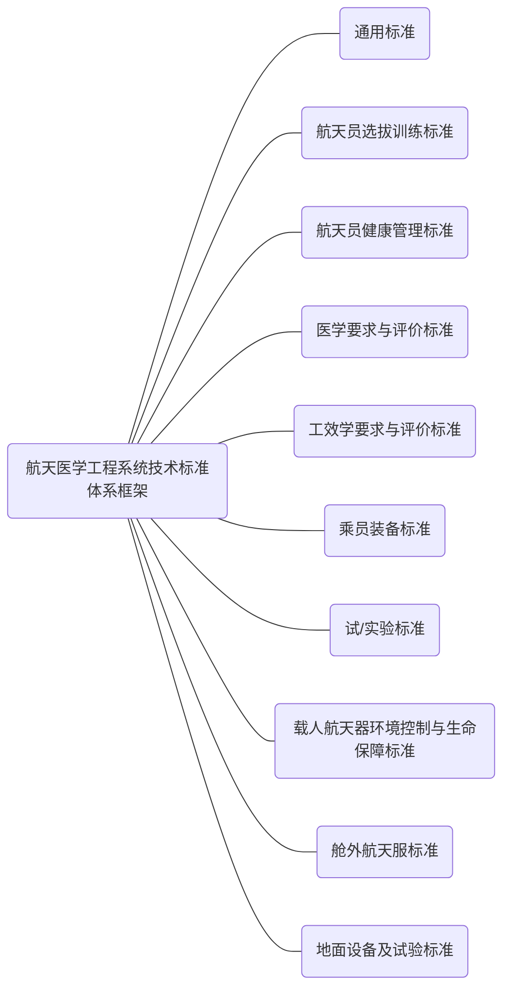

2020年，结合“十四五”标准化建设规划，坚持新发展理念，加快构建高质量发展的标准体系，充分发挥标准化在载人航天治理体系和治理能力现代化建设中的基础性、战略性作用，按照“充分继承、覆盖与需求牵引、适度前瞻开放、协调一致”等原则，重新梳理整合，修订发布了标准体系第五版，标准体系框架保留了原来的10大类，对标准项目进行了系列化归类，标准数量变化为537项，更加体现了标准与任务需求的紧密结合和着眼于载人航天长远建设规划。

目前的标准体系涉及的标准化对象多，包括`人、设备、环境、系统`等；涉及的标准项目专业技术领域更宽，系统整合性要求更高，通过对标准进行系统性的整合，提高了系统标准化运行和管理水平，提升系统研制水平和研制质量。

**通用标准包括：**航天员系统与其他系统的接口技术标准、术语标准等基础标准、总体试验标准、系统安全技术标准，以及系统标准化管理、材料标准、计量标准、科技信息等技术、管理标准。

**航天员选拔训练标准包括：**选拔标准以及针对交会对接技术、出舱活动技术、空间站技术等任务确立的航天员专项训练标准等。

**航天员健康管理标准包括：**航天员医学监督、医学保障标准，航天营养与食品标准，航天环境因素影响与防护标准，航天员心理健康管理标准等。

**医学要求与评价标准包括：**针对飞行器大气环境、力学环境、辐射环境及航天服内环境等确定的载人航天器工程设计医学要求与评价标准等。

**工效学标准：**包括空间站工效学评价要求和评价方法标准；出舱活动工效学要求和评价方法标准等。

**乘员装备标准包括：**系统产品验收技术标准，飞行产品研制系列规范标准，个人工作用品等设计规范、工艺规范、试验规范和验收规范等。

**试／实验标准包括：**针对地面模拟实验研究确定的生理实验规范、头低位卧床实验系列标准、动物选用标准、空间医学实验标准等。

**载人航天器环境控制与生命保障标准包括：**载人航天器环控生保分系统总体要求标准、供气压力控制技术标准、大气再生与控制技术标准以及水再生标准等。

**舱外航天服标准包括：**舱外航天服接口标准，总装技术、工艺规范、试验要求与方法等标准。

**地面设备及试验标准包括：**大型地面设备要求标准，航天环境模拟技术标准，飞行训练模拟技术标准等。

该标准体系在载人航天交会对接任务、空间实验室任务以及空间站任务初样阶段中得到了具体应用，对推动航天医学工程标准化工作健康、协调和可持续发展方面发挥了重要作用，为载人航天型号任务的成功实施提供了技术基础和技术保障。

>  参考文献：夏循华,黄伟芬,吴大蔚,陈欣,梁立华,陈金盾,邹璐.航天医学工程系统技术标准体系建设及思考[J].中国标准化,2021(07):109-113.

