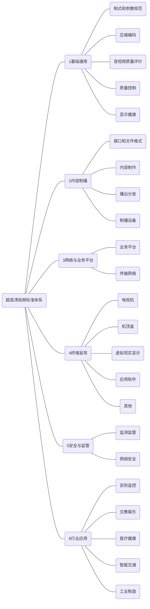

>  来源：[《工业和信息化部 国家广播电视总局关于印发超高清视频标准体系建设指南（2020版）的通知》（工信部联科〔2020〕71号）](http://www.gov.cn/zhengce/zhengceku/2020-05/26/content_5515088.htm)

超高清视频标准体系建设指南

（2020 版）

 2020 年 5 月

## 一、产业发展综述

超高清视频是具有 4K （ 3840×2160 像素） 或 8K（7680×4320 像素）分辨率，符合高帧率、高位深、广色域、高动态范围等技术要求的新一代视频。超高清视频具有更精细的图像细节、更强的信息承载能力和更广泛的应用范围， 为消费升级、行业创新、社会治理提供了新工具、新要素、新场景，有力推动经济社会各领域的深刻变革。

超高清视频的技术演进不仅催生了芯片、内容制播、显 示、传输等产业各环节的升级换代，还驱动了广播电视、安防监控、教育医疗、工业制造等行业以视频为核心的服务转型。超高清视频产业具有产业链长、涉及范围广、跨领域综合性强等特性，正在形成全新复杂的产业生态体系。预计到2022 年，我国超高清视频产业总体规模将超过 4 万亿元。

超高清视频产业生态体系主要包括核心元器件、内容制播、网络传输、终端呈现、服务以及应用等（图 1）。其中， 核心元器件为超高清视频专用基础元器件；内容制播包含超高清视频的生产与播出；网络传输是指超高清视频的传输渠道；终端呈现涉及电视机、机顶盒等产品；服务包括集成平台、内容供给、内容分发等服务业态；应用为超高清视频与各行业融合形成的行业应用模式。

图 1 超高清视频产业生态体系

## 二、建设指南编制总体要求

以《超高清视频产业发展行动计划（2019-2022 年）》为指导，从超高清视频产业发展实际出发，坚持标准先行， 建立覆盖采集、制作、传输、呈现、应用等全产业链的超高清视频标准体系，加强标准的统筹规划，鼓励国家标准、行业标准和团体标准协同发展，深化标准国际交流与合作，促进我国超高清视频产业健康可持续发展。

### （一）基本原则。

**系统布局，统筹推进。**加强标准体系顶层设计，明确标准化重点领域和方向，指导各领域标准化工作同步推进。加

强标准制定工作的整体协调，推进国家标准、行业标准与团体标准协同发展，鼓励社会团体制定发布团体标准。

**急用先行，应用牵引。**以需求为导向，紧贴产业发展实际，优先支持基础通用、共性技术等急需标准制定。以应用 为牵引，围绕推进超高清视频与重点行业领域融合创新发 展，持续开展行业应用等标准制定，不断完善标准体系。

**开放发展，合作共赢。**积极跟踪超高清视频领域技术发展趋势，加强与国际标准化组织、行业协会等交流与合作。鼓励我国企事业单位深度参与国际标准化活动，共同制定国际标准，为全球超高清视频产业发展提供技术支撑。

### （二）工作目标。

到 2020 年，初步形成超高清视频标准体系，制定急需标准 20 项以上，重点研制基础通用、内容制播、终端呈现、行业应用等关键技术标准及测试标准。

到 2022 年，进一步完善超高清视频标准体系，制定标准 50 项以上，重点推进广播电视、文教娱乐、安防监控、医疗健康、智能交通、工业制造等重点领域行业应用的标准化工作。

## 三、标准体系建设内容

### （一）标准体系框架。

结合技术和产业发展实际，超高清视频标准体系框架主 要由基础通用、内容制播、网络与业务平台、终端呈现、安 全与监管、行业应用等六个部分组成（图 2）。

图 2 超高清视频标准体系框架

### （二）标准体系主要内容。

**1.基础通用标准。**包括制式和参数规范、压缩编码、音视频质量评价、质量控制及显示健康等标准，主要规范超高清视频领域的素材交换和质量控制等。

**2.内容制播标准。**包括接口和文件格式、内容制作、播出分发、制播设备等标准，主要规范超高清视频内容制作及播出等。

**3.网络与业务平台标准。**包括业务平台与传输网络等标准，主要规范超高清视频的业务平台接口与传输等。

**4.终端呈现标准。**包括超高清电视机、机顶盒、投影机、虚拟现实显示终端、应用软件等标准，主要规范超高清视频终端呈现等。

**5.安全与监管标准。**包括超高清视频网络安全、监测监管相关标准，主要规范安全传输体系架构、应用软件安全、交互服务安全等。

**6.行业应用标准。**包括超高清视频在安防监控、文教娱乐、医疗健康、智能交通、工业制造等标准，主要规范超高清视频与重点行业领域的融合应用等。

#### （1） 安防监控应用。

包含超高清安防监控系统和设备标准，主要规范视频采集、编码、传输、显示等方面的技术要求和测量方法等。

#### （2） 文教娱乐应用。

包含超高清互动显示屏、超高清影院系统、超高清视频会议系统等标准，主要规范产品质量，指导超高清技术在该 领域的应用等。

#### （3） 医疗健康应用。

包含超高清术野摄像机、超高清医疗监视器等产品标准和超高清医疗系统应用规范，引导超高清视频在医疗健康行业的应用。

#### （4） 智能交通应用。

包含超高清车载行车记录仪、超高清车载显示器等产品标准，主要规范车载环境下摄像头和显示器的光学性能、环境适应性、可靠性等关键指标等。

#### （5） 工业制造应用。

包括工业生产线中使用的智能图像识别、自动光学识别、非接触光学测量、非物理缺陷维修等测量标准，主要规范超高清视频在工业制造领域的应用等。

## 四、重点工作

**（一）加强统筹协调。**在工业和信息化部、国家广播电视总局的指导下，充分利用多部门协调、多标委会协作等工作机制，积极发挥相关标准化技术组织的作用，着力构建满足产业发展需求、先进适用的超高清视频标准体系。

**（二）实施动态更新。**紧跟超高清视频技术发展趋势， 系统分析标准化工作中存在的不足和漏洞，对现有标准体系建设指南进行动态更新完善，不断适应产业发展需求。

**（三）加快标准研制。**加快推进超高清视频相关国家标准、行业标准的制定，推动标准试验验证平台和公共服务平台建设，为标准的制定和实施提供技术支撑和保障。

**（四）加强宣传培训。**充分发挥主管部门、产业联盟和产业公共服务平台的作用，加强标准体系和重点标准的宣传培训工作，推动标准的有效实施。

**（五）推进国际合作。**加强与国际电信联盟（ITU）、国际标准化组织（ISO）、国际电工委员会（IEC）等国际标准化组织的交流与合作，积极参与国际标准化活动，为全球超高清视频产业发展贡献中国方案。

附件：[超高清视频标准体系标准项目明细表]((http://www.gov.cn/zhengce/zhengceku/2020-05/26/content_5515088.htm))
